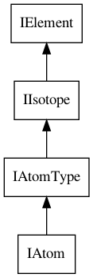
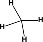
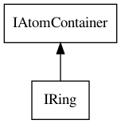

#  Atoms, Bonds and Molecules

The basic objects in the CDK are the <a name="tp1">[`IAtom`](http://cdk.github.io/cdk/latest/docs/api/org/openscience/cdk/interfaces/IAtom.html)</a>, [`IBond`](http://cdk.github.io/cdk/latest/docs/api/org/openscience/cdk/interfaces/IBond.html) and
[`IAtomContainer`](http://cdk.github.io/cdk/latest/docs/api/org/openscience/cdk/interfaces/IAtomContainer.html) [<a href="#citeref1">1</a>].
The name of the latter is somewhat misleading, as it contains
not just [`IAtom`](http://cdk.github.io/cdk/latest/docs/api/org/openscience/cdk/interfaces/IAtom.html)s but also [`IBond`](http://cdk.github.io/cdk/latest/docs/api/org/openscience/cdk/interfaces/IBond.html)s. The primary use of the model is the
graph-based representation of molecules, where bonds are edges between
two atoms being the nodes [<a href="#citeref2">2</a>].

Before we start, it is important to note that CDK 2.0 has an important
convention around object properties: when a property is unset, the
object’s field is set to null. This brings in sources for `NullPointerExceptions`,
but also allows us to distinguish between, for example, zero and unset
formal charge. In the former case, the formal charge value be set and have
a zero value; in the latter case, the field has a null value, indicating the
formal charge is currently unknown.

## Atoms

The CDK interface <a name="tp2">[`IAtom`](http://cdk.github.io/cdk/latest/docs/api/org/openscience/cdk/interfaces/IAtom.html)</a> is the underlying data model of atoms. Creating
a new atom is fairly easy. For example, we can create an atom of element
type carbon, as defined by the element’s atomic number that we pass as parameter
in the constructor:

**<a name="script:CreateAtom3">Script 3.1</a>** [code/CreateAtom3.groovy](code/CreateAtom3.code.md)
```groovy
atom = new Atom(6);
```

An atom can also be constructed by passing in the symbol but this is marginally
less efficient:

**<a name="script:CreateAtom1">Script 3.2</a>** [code/CreateAtom1.groovy](code/CreateAtom1.code.md)
```groovy
IAtom atom = new Atom("C");
```

Alternatively, we can also construct a new carbon atom, by passing a
carbon [`IElement`](http://cdk.github.io/cdk/latest/docs/api/org/openscience/cdk/interfaces/IElement.html), conveniently provided by the [`Elements`](http://cdk.github.io/cdk/latest/docs/api/org/openscience/cdk/config/Elements.html) class:

**<a name="script:CreateAtom2">Script 3.3</a>** [code/CreateAtom2.groovy](code/CreateAtom2.code.md)
```groovy
IAtom atom = new Atom(Elements.CARBON);
```

A CDK atom has many properties, many of them inherited from the `IElement`,
`IIsotope` and `IAtomType` interfaces. Figure [4.1](#fig:atomInheritance) shows the interface
inheritance specified by the CDK data model.

These constructors will set the atomic number of the atom:

```plain
atomic number: 6
```

<a name="fig:atomInheritance"></a>

<br />**Figure 4.1**: The `IAtom` interface extends the `IAtomType` interface, which extends the `IIsotope` interface, which, in turn, extends the `IElement` interface.

### IElement

The most common property of <a name="tp3">[`IElement`](http://cdk.github.io/cdk/latest/docs/api/org/openscience/cdk/interfaces/IElement.html)</a>s are their symbol and atomic
number. Because the `IAtom` extends the `IElement`, CDK atoms also have
these properties. Therefore, we can set these properties for atoms
manually too:

**<a name="script:ElementProperties">Script 3.4</a>** [code/ElementProperties.groovy](code/ElementProperties.code.md)
```groovy
atom.setSymbol("N")
atom.setAtomicNumber(7)
```

Of course, we can use the matching get methods to recover the properties:

**<a name="script:ElementGetProperties">Script 3.5</a>** [code/ElementGetProperties.groovy](code/ElementGetProperties.code.md)
```groovy
IAtom atom = new Atom(Elements.CARBON);
println "Symbol: " + atom.getSymbol()
println "Atomic number: " + atom.getAtomicNumber()
```

which outputs:

```plain
Symbol: C
Atomic number: 6
```

### IIsotope

The <a name="tp4">`IIsotope`</a> information consists of the *mass number*, *exact mass* and
*natural abundance*:

**<a name="script:IsotopeProperties">Script 3.6</a>** [code/IsotopeProperties.groovy](code/IsotopeProperties.code.md)
```groovy
IAtom atom = new Atom("C");
atom.setMassNumber(13)
atom.setNaturalAbundance(1.07)
atom.setExactMass(13.00335484)
```

Here too, the complementary get methods are available:

**<a name="script:IsotopeGetProperties">Script 3.7</a>** [code/IsotopeGetProperties.groovy](code/IsotopeGetProperties.code.md)
```groovy
println "Mass number: " + atom.getMassNumber()
println "Natural abundance: " + atom.getNaturalAbundance()
println "Exact mass: " + atom.getExactMass()
```

giving:

```plain
Mass number: 13
Natural abundance: 1.07
Exact mass: 13.00335484
```

Appendix [B](appisotopes.md#sec:isotopes) lists all isotopes defined in the CDK with a natural
abundance of more than 0.1.


### IAtomType

Atom types are an important concept in cheminformatics. They describe
some basic facts about that particular atom in some particular
configuration. These properties are used in many cheminformatics algorithms,
including adding hydrogens to hydrogen-depleted chemical graphs (see
Section [15.4.1](missing.md#sec:implicithydrogens)) and force fields. Chapter [13](atomtype.md#sec:atomtype) provides much more detail
on the atom type infrastructure in the CDK library, and, for example,
details how atom types can be perceived, and how atom type information
is set for atoms.

The <a name="tp5">`IAtomType`</a> interface contains fields that relate to atom types. These
properties include formal charge, neighbor count, maximum bond order
and atom type name:

**<a name="script:AtomTypeProperties">Script 3.8</a>** [code/AtomTypeProperties.groovy](code/AtomTypeProperties.code.md)
```groovy
atom.setAtomTypeName("C.3")
atom.setFormalCharge(-1)
atom.setMaxBondOrder(IBond.Order.SINGLE)
atom.setFormalNeighbourCount(4)
```

### Coordinates

The `IAtom` class supports three types of coordinates: <a name="tp6">2D coordinates</a>,
used for diagrams, <a name="tp7">3D coordinates</a> for geometries, and crystal <a name="tp8">unit cell</a>
or <a name="tp9">notional coordinates</a>. These properties are set with the respective
methods:

**<a name="script:AtomCoordinates">Script 3.9</a>** [code/AtomCoordinates.groovy](code/AtomCoordinates.code.md)
```groovy
atom.setPoint2d(
  new Point2d(1.0, 2.3)
)
atom.setPoint3d(
  new Point3d(-2.0, -3.5, 4.7)
)
atom.setFractionalPoint3d(
  new Point3d(0.1, 0.5, 0.25)
)
```

The latter coordinates define the locations of the atoms with respect to
(or inside) the crystal structure’s unit cell. Section 5.2 explains the full
crystal structure functionality.

## Bonds

The <a name="tp10">[`IBond`](http://cdk.github.io/cdk/latest/docs/api/org/openscience/cdk/interfaces/IBond.html)</a> interface of the CDK is an interaction between two or more
`IAtom`s, extending the <a name="tp11">`IElectronContainer`</a> interface. While the most
common application in the CDK originates from graph theory [<a href="#citeref2">2</a>], it is not
restricted to that. That said, many algorithms implemented in the CDK
expect a graph theory based model, where each bond connects two, and
not more, atoms.

For example, to create <a name="tp12">ethanol</a> we write:

**<a name="script:Ethanol">Script 3.10</a>** [code/Ethanol.groovy](code/Ethanol.code.md)
```groovy
IAtom atom1 = new Atom("C")
IAtom atom2 = new Atom("C")
IAtom atom3 = new Atom("O")
IBond bond1 = new Bond(atom1, atom2, IBond.Order.SINGLE);
IBond bond2 = new Bond(atom2, atom3, IBond.Order.SINGLE);
```

The CDK has a few bond orders, which we can list with this groovy code:

**<a name="script:BondOrders">Script 3.11</a>** [code/BondOrders.groovy](code/BondOrders.code.md)
```groovy
IBond.Order.each {
  println it
}
```

which outputs:

```plain
SINGLE
DOUBLE
TRIPLE
QUADRUPLE
QUINTUPLE
SEXTUPLE
UNSET
```

As you might notice, there is no `AROMATIC` bond defined. This is
deliberate and the CDK allows to define single-double bond order patterns at
the same time as aromaticity information. For example, a kekule
structure of <a name="tp13">benzene</a> with bonds marked as aromatic can be constructed with:

**<a name="script:AromaticBond">Script 3.12</a>** [code/AromaticBond.groovy](code/AromaticBond.code.md)
```groovy
IAtom atom1 = new Atom("C")
IAtom atom2 = new Atom("C")
IAtom atom3 = new Atom("C")
IAtom atom4 = new Atom("C")
IAtom atom5 = new Atom("C")
IAtom atom6 = new Atom("C")
IBond bond1 = new Bond(atom1, atom2, IBond.Order.SINGLE)
IBond bond2 = new Bond(atom2, atom3, IBond.Order.DOUBLE)
IBond bond3 = new Bond(atom3, atom4, IBond.Order.SINGLE)
IBond bond4 = new Bond(atom4, atom5, IBond.Order.DOUBLE)
IBond bond5 = new Bond(atom5, atom6, IBond.Order.SINGLE)
IBond bond6 = new Bond(atom6, atom1, IBond.Order.DOUBLE)
bond1.setFlag(CDKConstants.ISAROMATIC, true);
bond2.setFlag(CDKConstants.ISAROMATIC, true);
bond3.setFlag(CDKConstants.ISAROMATIC, true);
bond4.setFlag(CDKConstants.ISAROMATIC, true);
bond5.setFlag(CDKConstants.ISAROMATIC, true);
bond6.setFlag(CDKConstants.ISAROMATIC, true);
```

### Electron counts

Bond orders, as we have seen earlier, are commonly used in the CDK to
indicate the electronic properties of a bond. At the same time, each bond
consists of a number of atoms. For example, in a single (sigma) bond, two
<a name="tp14">electrons</a> are involved. In a double (pi) bond, four electrons are involved,
and in a triple bond, six electrons are involved. We can report on the
electron counts for the various orders with this code:

**<a name="script:ElectronCounts">Script 3.13</a>** [code/ElectronCounts.groovy](code/ElectronCounts.code.md)
```groovy
IBond.Order.each { order ->
  bond = new Bond(
    new Atom("C"), new Atom("C"),
    order
  )
  println "Bond order $order has " +
    bond.electronCount + " electrons"
}
```

showing us the default implementation:

```plain
Bond order SINGLE has 2 electrons
Bond order DOUBLE has 4 electrons
Bond order TRIPLE has 6 electrons
Bond order QUADRUPLE has 8 electrons
Bond order QUINTUPLE has 10 electrons
Bond order SEXTUPLE has 12 electrons
Bond order UNSET has 0 electrons
```
 
### Bond stereochemistry

The `IBond.setStereo()` method is discussed in Section [5.1](stereo.md#sec:stereo:bond).

<a name="sec:molecules"></a>
## Molecules

We already saw in the previous pieces of code how the CDK can be used to create
molecules, and while the above is, strictly speaking, enough to find all atoms in the
<a name="tp15">molecule</a> starting with only one of the atoms in the molecule, it often is more
convenient to store all atoms and bonds in a container.

The CDK has one container: the [`IAtomContainer`](http://cdk.github.io/cdk/latest/docs/api/org/openscience/cdk/interfaces/IAtomContainer.html).
It is a general container to holds atoms an bonds, and can contain both
unconnected as well asfully connected structures. The latter
has the added implication that it holds a single molecule, of which all
atoms are connected to each other via one or more covalent bonds.

Adding atoms and bonds is done by the methods `addAtom(IAtom)` and
`addBond(IBond)`:

**<a name="script:AtomContainerAddAtomsAndBonds">Script 3.14</a>** [code/AtomContainerAddAtomsAndBonds.groovy](code/AtomContainerAddAtomsAndBonds.code.md)
```groovy
mol = new AtomContainer();
mol.addAtom(new Atom("C"));
mol.addAtom(new Atom("H"));
mol.addAtom(new Atom("H"));
mol.addAtom(new Atom("H"));
mol.addAtom(new Atom("H"));
mol.addBond(new Bond(mol.getAtom(0), mol.getAtom(1)));
mol.addBond(new Bond(mol.getAtom(0), mol.getAtom(2)));
mol.addBond(new Bond(mol.getAtom(0), mol.getAtom(3)));
mol.addBond(new Bond(mol.getAtom(0), mol.getAtom(4)));
```

The `addBond()` method has an alternative which takes three parameters:
the first atom, the second atom, and the bond order. Note that atom indices
follows programmers habits and starts at `0`, as you can observe in the
previous example too. This shortens the previous version a bit:

**<a name="script:AtomContainerAddAtomsAndBonds2">Script 3.15</a>** [code/AtomContainerAddAtomsAndBonds2.groovy](code/AtomContainerAddAtomsAndBonds2.code.md)
```groovy
mol = new AtomContainer();
mol.addAtom(new Atom("C"));
mol.addAtom(new Atom("H"));
mol.addAtom(new Atom("H"));
mol.addAtom(new Atom("H"));
mol.addAtom(new Atom("H"));
mol.addBond(0,1,IBond.Order.SINGLE);
mol.addBond(0,2,IBond.Order.SINGLE);
mol.addBond(0,3,IBond.Order.SINGLE);
mol.addBond(0,4,IBond.Order.SINGLE);
```

### Iterating over atoms and bonds

The [`IAtomContainer`](http://cdk.github.io/cdk/latest/docs/api/org/openscience/cdk/interfaces/IAtomContainer.html) comes with convenience methods to iterate over atoms
and bonds. Both methods use the `Iterable` interfaces, and for atoms we
do:

**<a name="script:CountHydrogens">Script 3.16</a>** [code/CountHydrogens.groovy](code/CountHydrogens.code.md)
```groovy
int hydrogenCount = 0
for (IAtom atom : mol.atoms()) {
    if ("H".equals(atom.getSymbol())) hydrogenCount++
}
println "Number of hydrogens: $hydrogenCount"
```

which returns

```plain
Number of hydrogens: 4
```

And for bonds the equivalent:

**<a name="script:CountDoubleBonds">Script 3.17</a>** [code/CountDoubleBonds.groovy](code/CountDoubleBonds.code.md)
```groovy
int doubleBondCount = 0
for (IBond bond : mol.bonds()) {
  if (IBond.Order.DOUBLE == bond.getOrder())
    doubleBondCount++
}
println "Number of double bonds: $doubleBondCount"
```

giving

```plain
Number of double bonds: 1
```

### Neighboring atoms and bonds

It is quite common that you like to see what atoms are connected
to one particular atom. For example, you may wish to count how many
bonds surround a particular atom. Or, you may want to list all atoms
that are bound to this atom. The [`IAtomContainer`](http://cdk.github.io/cdk/latest/docs/api/org/openscience/cdk/interfaces/IAtomContainer.html) class
provides methods for these use cases. But it should be stressed that
these methods do only take into account explicit hydrogens (see the
next section).

Let's consider ethanol again, given in Script [3.10](#script:Ethanol),
and count the number of neighbors for each atom:

**<a name="script:NeighborCount">Script 3.18</a>** [code/NeighborCount.groovy](code/NeighborCount.code.md)
```groovy
for (atom in ethanol.atoms()) {
  println atom.getSymbol() +
    " " + ethanol.getConnectedAtomsCount(atom)
}
```

which lists for the three heavy atoms:

```plain
C 1
C 2
O 1
```

Similarly, we can also list all <a name="tp16">connected atoms</a>:

**<a name="script:ConnectedAtoms">Script 3.19</a>** [code/ConnectedAtoms.groovy](code/ConnectedAtoms.code.md)
```groovy
for (atom in ethanol.atoms()) {
  print atom.getSymbol() +
    " is connected to "
  for (neighbor in ethanol.getConnectedAtomsList(atom)) {
    print neighbor.getSymbol() + " "
  }
  println ""
}
```

which outputs:

```plain
C is connected to C 
C is connected to C O 
O is connected to C 
```

We can do the same thing for <a name="tp17">connected bonds</a>:

**<a name="script:ConnectedBonds">Script 3.20</a>** [code/ConnectedBonds.groovy](code/ConnectedBonds.code.md)
```groovy
for (atom in ethanol.atoms()) {
  print atom.getSymbol() +
    " has bond(s)"
  for (bond in ethanol.getConnectedBondsList(atom)) {
    print " " + bond.getOrder()
  }
  println ""
}
```

which outputs:

```plain
C has bond(s) SINGLE
C has bond(s) SINGLE SINGLE
O has bond(s) SINGLE
```

<a name="sec:molecularFormula"></a>
## Molecular Formula

Getting the <a name="tp18">molecular formula</a> of a molecule and returning that as a String
is both done with the [`MolecularFormulaManipulator`](http://cdk.github.io/cdk/latest/docs/api/org/openscience/cdk/tools/manipulator/MolecularFormulaManipulator.html) class:

**<a name="script:MFGeneration">Script 3.21</a>** [code/MFGeneration.groovy](code/MFGeneration.code.md)
```groovy
molForm = MolecularFormulaManipulator.getMolecularFormula(
  azulene
)
mfString = MolecularFormulaManipulator.getString(molForm)
println "Azulene: $mfString"
```

giving:

```plain
Azulene: C10H8
```

<a name="sec:hydrogens"></a>
## Implicit and Explicit Hydrogens

The CDK has two concepts for hydrogens:
*implicit hydrogens* and *explicit hydrogens*. Explicit
hydrogens are hydrogens that are separate vertices on the chemical graph.
Implicit hydrogens, however, are not, and are attributes of
existing vertices.

<a name="fig:methaneImExplicit"></a>
 
<br />**Figure 4.2**: Methane with implicit (left) and explicit (right) hydrogens.
<!-- <code>MethaneImplicit</code> -->
<!-- <code>MethaneExplicit</code> -->

For example, if we represent methane as
a chemical graph, we can define either a hydrogen-depleted
chemical graph with a single carbon atom and zero bonds, or
a graph with one carbon and four hydrogen atoms, and four
bonds connecting the hydrogens to the central carbon. In the latter
case, the hydrogens are explicit, while in the former case we
can add those four hydrogens as implicit hydrogens on these
carbon.

The first option in CDK code looks like:

**<a name="script:HydrogenDepletedGraph">Script 3.24</a>** [code/HydrogenDepletedGraph.groovy](code/HydrogenDepletedGraph.code.md)
```groovy
molecule = new AtomContainer();
carbon = new Atom(Elements.CARBON);
carbon.setImplicitHydrogenCount(4);
molecule.addAtom(carbon);
```

while the alternative look like:

**<a name="script:HydrogenExplicitGraph">Script 3.25</a>** [code/HydrogenExplicitGraph.groovy](code/HydrogenExplicitGraph.code.md)
```groovy
molecule = new AtomContainer();
carbon = new Atom(Elements.CARBON);
molecule.addAtom(carbon);
for (int i=1; i<=4; i++) {
  hydrogen = new Atom(Elements.HYDROGEN);
  molecule.addAtom(hydrogen);
  molecule.addBond(0, i, IBond.Order.SINGLE);
}
```

Section [15.4](missing.md#sec:missinghydrogens) describes how hydrogens can
be added programmatically.

<a name="sec:chemobjects"></a>
## Chemical Objects

Another interface that must be introduced is the `IChemOject`
as it plays an key role in the CDK data model. Almost all interfaces
used in the data model inherit from this interface. The [`IChemObject`](http://cdk.github.io/cdk/latest/docs/api/org/openscience/cdk/interfaces/IChemObject.html)
interface provides a bit of basic functionality, including support
for object identifiers, properties, and flags.

For example. <a name="tp19">identifiers</a> are set and retrieved with the `setID()` and
`getID()` methods:

**<a name="script:ChemObjectIdentifiers">Script 3.26</a>** [code/ChemObjectIdentifiers.groovy](code/ChemObjectIdentifiers.code.md)
```groovy
butane = new AtomContainer();
butane.setID("cdkbook000000001")
print "ID: " + butane.getID()
```

If you have more than one identifier, or other <a name="tp20">properties</a> you like to
associate with objects, you can use the `setProperty()` and
`getProperty()` methods:

**<a name="script:ChemObjectProperties">Script 3.27</a>** [code/ChemObjectProperties.groovy](code/ChemObjectProperties.code.md)
```groovy
butane = new AtomContainer();
butane.setProperty(
  "InChI", "InChI=1/C4H10/c1-3-4-2/h3-4H2,1-2H3"
)
print "InChI: " + butane.getProperty("InChI")
```

For example, we can use this approach to assign labels to atoms, such as in this
example from substructure searching (see Chapter ??):

**<a name="script:AtomLabels">Script 3.28</a>** [code/AtomLabels.groovy](code/AtomLabels.code.md)
```groovy
butane = MoleculeFactory.makeAlkane(4);
butane.atoms().each { atom ->
  atom.setProperty("Label", "Molecule")
}
ccc = MoleculeFactory.makeAlkane(3);
ccc.atoms().each { atom ->
  atom.setProperty("Label", "Substructure")
}
```

The [`CDKConstants`](http://cdk.github.io/cdk/latest/docs/api/org/openscience/cdk/CDKConstants.html) class provides a few constants for common properties:

**<a name="script:CDKConstantsProperties">Script 3.29</a>** [code/CDKConstantsProperties.groovy](code/CDKConstantsProperties.code.md)
```groovy
println "Title: " + 
  aspirin.getProperty(CDKConstants.TITLE)
println "InChI: " +
  aspirin.getProperty(CDKConstants.INCHI)
println "SMILES: " +
  aspirin.getProperty(CDKConstants.SMILES)
println "CAS registry number: " +
  aspirin.getProperty(CDKConstants.CASRN)
println "COMMENT: " +
  aspirin.getProperty(CDKConstants.COMMENT)
println "NAMES: " +
  aspirin.getProperty(CDKConstants.NAMES)
```

outputting:

```plain
Title: aspirin
InChI: InChI=1/C9H8O4/c1-6(10)13-8-5-3-2-4-7(8)9...
  (11)12/h2-5H,1H3,(H,11,12)
SMILES: CC(=O)Oc1ccccc1C(=O)O
CAS registry number: 50-78-2
COMMENT: Against headaches.
NAMES: 2-(acetyloxy)benzoic acid
```

A third characteristic of the [`IChemObject`](http://cdk.github.io/cdk/latest/docs/api/org/openscience/cdk/interfaces/IChemObject.html) interface is the concept of
<a name="tp21">flags</a>. Flags are used in the CDK to indicate, for example, if
an atom or bond is aromatic (see Script [3.12](#script:AromaticBond))
or if an atom is part of a ring:

**<a name="script:RingBond">Script 3.30</a>** [code/RingBond.groovy](code/RingBond.code.md)
```groovy
benzene = MoleculeFactory.makeBenzene();
benzene.bonds().each { bond ->
  bond.setFlag(CDKConstants.ISINRING, true)
  println "Is ring bond: " +
    bond.getFlag(CDKConstants.ISINRING)
}
```

The next section talks about the CDK data class for \topic{rings}.

<a name="sec:rings"></a>
## Rings

One important aspect of molecules is rings, partly because rings can show
interesting chemical phenomena. For example, if the number of FIXME electrons
is right, then the ring will become aromatic, as we commonly observer in
phenyl rings, such as in benzene. But, cheminformatics has many other
aspects where one like to know about those rings. For example, 2D coordinate
generator (see Section [15.5](missing.md#sec:layout)) requires algorithms to know what
the rings are in a molecule.

<a name="fig:ring"></a>

<br />**Figure 4.3**: The `IRing` interface extends the `IAtomContainer` interface and is used to hold information about rings.

Section [14.2](graph.md#sec:spanningtree) explains what functionality the CDK has to
determine a bond takes part in a ring system. Here, we just introduce the
[`IRing`](http://cdk.github.io/cdk/latest/docs/api/org/openscience/cdk/interfaces/IRing.html) interface, which extends the more general `IAtomContainer`
as shown in Figure [4.3](#fig:ring). Practically, there is nothing much to
say about the IRing interface. One method it adds, is to get the size of the
ring:

**<a name="script:RingExample">Script 3.31</a>** [code/RingExample.groovy](code/RingExample.code.md)
```groovy
IRing ring = new Ring(5, "C")
println "Ring size: " + ring.getRingSize()
println "Ring atoms: " + ring.getAtomCount()
println "Ring bonds: " + ring.getBondCount()
```

But this should be by definition the same as the number as atoms and bonds:

```plain
Ring size: 5
Ring atoms: 5
Ring bonds: 5
```

An overview of three algorithms to find rings in atom containers is provided
in Section [14.3](graph.md#sec:ringsearch). Additionally, you may also be interested
in ring sets, explained in Section ??.


## References

1. <a name="citeref1"></a>Steinbeck C, Han Y, Kuhn S, Horlacher O, Luttmann E, Luttmann E, et al. The Chemistry Development Kit (CDK): an open-source Java library for Chemo- and Bioinformatics. JCICS. 2003 Feb 11;43(2):493–500.  doi:[10.1021/CI025584Y](https://doi.org/10.1021/CI025584Y) ([Scholia](https://scholia.toolforge.org/doi/10.1021/CI025584Y))
2. <a name="citeref2"></a>Balaban AT. Applications of graph theory in chemistry. JCICS. 1985 Aug 1;25(3):334–43.  doi:[10.1021/CI00047A033](https://doi.org/10.1021/CI00047A033) ([Scholia](https://scholia.toolforge.org/doi/10.1021/CI00047A033))

