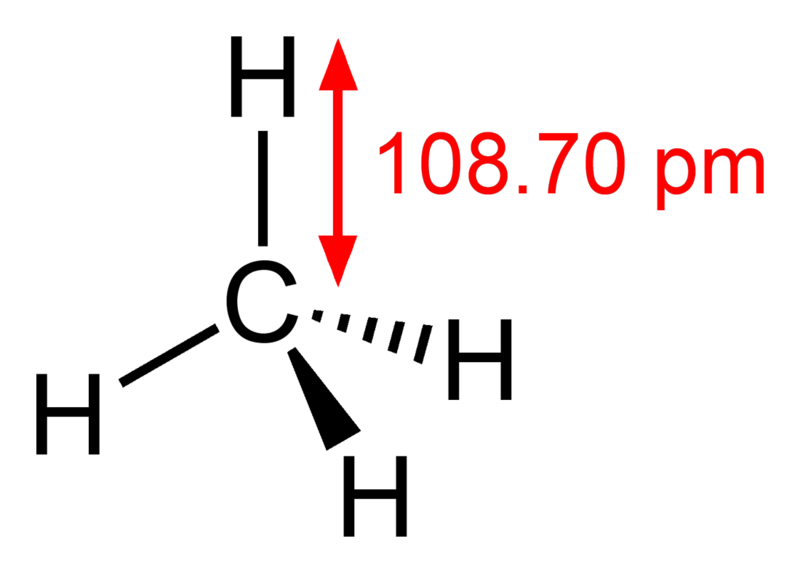

<a name="sec:atomtype"></a>
# Atom types

Graph theory is nice, but we are, of course, interested in chemistry. While
graph theory has its limitations, we can do a lot of interesting things with
just the vertex-edge formalism. Particularly, if we combine it with the concept
of <a name="tp1">atom types</a>.

An atom type is a concept to describe certain properties of the atom. For
example, force fields use atom types to describe geometrical and interaction
properties of the atoms in a molecule. Within such formalism, a sp<sup>3</sup> carbon
is a carbon with four neighbors organized in a tetrahedral coordination,
as depicted in Figure [9.1](#fig:methane).

<a name="fig:methane"></a>

<br />**Figure 9.1**: 3D structure of methane, showing a sp$^3$ carbon surrounded byfour hydrogens. Image from Wikipedia: \url{http://en.wikipedia.org/wiki/File:Methane-CRC-MW-dimensions-2D.png} (public domain).

<a name="sec:cdkatomtype"></a>
## The CDK atom type model

A complete description for the atom types of the following atomic properties
is needed by the various algorithms in the CDK:

* element
* formal charge
* number of bonded neighbors
* hybridization (sp<sup>3</sup>, sp<sup>2</sup>, sp, etc)
* number of lone pairs
* number of π bonds

For example, the carbon in methane, we can list these properties with
this code:

**Script** [code/CDKAtomTypeProperties.groovy](code/CDKAtomTypeProperties.code.md)
```groovy
factory = AtomTypeFactory.getInstance(
  "org/openscience/cdk/dict/data/cdk-atom-types.owl",
  SilentChemObjectBuilder.getInstance()
);
IAtomType type = factory.getAtomType("C.sp3");
println "element       : $type.symbol"
println "formal change : $type.formalCharge"
println "hybridization : $type.hybridization"
println "neighbors     : $type.formalNeighbourCount"
println "lone pairs    : " +
  type.getProperty(CDKConstants.LONE_PAIR_COUNT)
println "pi bonds      : " +
  type.getProperty(CDKConstants.PI_BOND_COUNT)
```

We will see the carbon has these properties:

```plain
element       : C
formal change : 0
hybridization : SP3
neighbors     : 4
lone pairs    : 0
pi bonds      : 0
```

For a carbon in benzene (`C.sp2`), it would list:

<outCsp2CarbonProperties</out>

And for the oxygen in hydroxide (`C.minus`), it would give:

```plain
element       : O
formal change : -1
hybridization : SP3
neighbors     : 1
lone pairs    : 3
pi bonds      : 0
```

A full list of CDK atom types is given in a table in Appendix ??.

