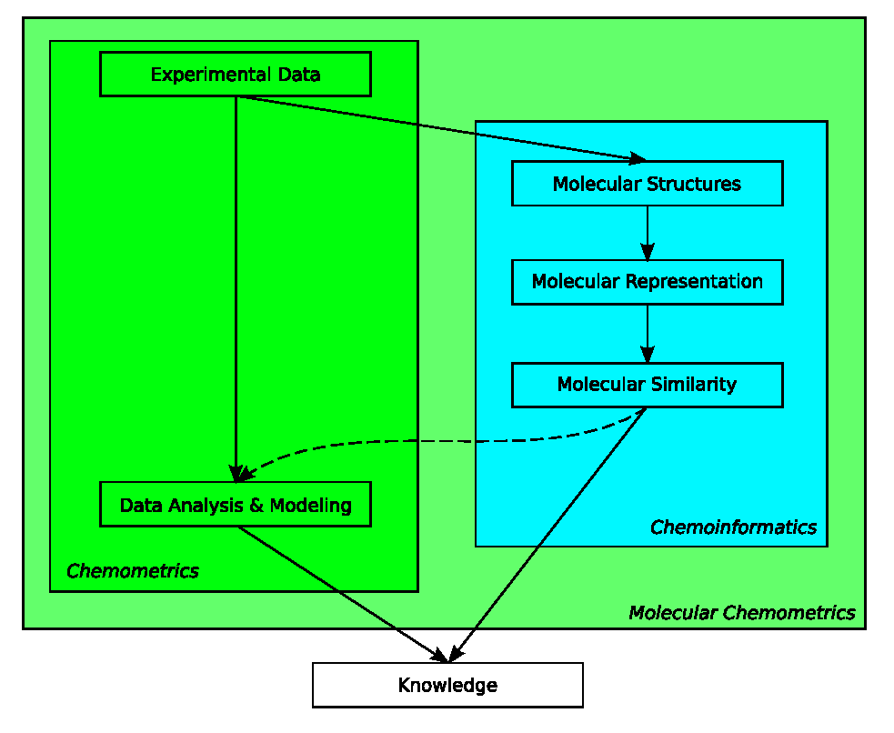

<section level="#" label="cheminfo">Cheminformatics</section>

*Note: this chapter is an evolved version of a chapter of [my PhD
thesis](https://tools.wmflabs.org/scholia/work/Q25713029).*

While the purpose of this book is not to educate in <topic>cheminformatics</topic> (see Chapter <xref>intro</xref>),
this chapter provides minimal information about the representation of molecules and molecular systems.
Such a representation is needed to allow analysis and manipulation of chemical
structures in the computer. This is of paramount importance in areas like
drug design, synthesis planning, property prediction, crystal structure engineering,
structure elucidation, searching in chemical literature, exchange of chemical knowledge,
and structure elucidation.

Many different representations have been developed, each capturing different
bits of information about the molecular system under study. Unfortunately,
in many cases it is unclear which part of the information is essential for a
certain application. For example, although the <topic>boiling points</topic> correlates well
with the number of carbon atoms in a homologous series of alkanes [<cite>Q28837922</cite>]
(see Figure <xref>bp:alkanes</xref>), the
carbon count descriptor is not generally useful for
predicting other properties, or even the same property for a more diverse set
of molecules. From simple physico-chemical principles, it is clear why this
is the case.

<figure label="bp:alkanes" caption="Diagram showing the relation between the boiling point and the number
of carbon atoms in alkanes.">
  
</figure>

However, for more complex problems there is very little a-priori
knowledge that guides us in choosing appropriate descriptors. Nevertheless,
in certain areas specific habits have evolved; for example, a large part of the
quantitative structure-activity and structure-property relationship (<topic>QSAR</topic> and
<topic>QSPR</topic>) community routinely calculates hundreds or thousands of simple molecular
descriptors, and uses various variable-selection techniques to extract the most
useful ones. Unfortunately, validation of this process is almost
impossible due to the small size of data sets. It would a giant leap forward
if we could say beforehand, based on the characteristics of the molecular system
and our aim, what descriptors would be most informative.
This is currently, however, still too far-fetched. Therefore, we are forced to
judge the quality of the representation on the basis on the quality of the
prediction: if we are able to correctly predict properties of new compounds,
then we conclude that the representations contains relevant information.

This chapter describes the role of representation in modeling properties of
molecular systems of organic molecules and in the exchange of molecular
information. The
following paragraphs give an overview on useful representations.

## Molecular Representations

The two most common methods to represent organic molecules are the (systematic)
name and the 2D drawing of the molecule. They identify the molecule of interest,
but cannot be used for machine processing. To prevent ambiguities,
conventions describing how molecules should be named and drawn are needed. <topic>IUPAC name</topic>
recommendations, and <topic>line notations</topic> such as the
<topic>Wiswesser Line Notation</topic> [<cite>Q29042322</cite>] and the
<topic>SMILES</topic> [<cite>Q28090714</cite>],
are examples for standardized conventions
for labeling molecules (see Section <xref>lineNotations</xref>).
In addition, these representations do not include
information on the 3D conformation.

The systemic naming conventions are based on chemical graphs, which represent
atoms as vertices and bonds as edges, defining the exact connectivity within the
molecule. For example, IUPAC recommended names, such as 2-butanol, number
attachment points based on <topic>graph theory</topic>.
In combination with 3D coordinate information, many
descriptors have been developed to capture particular features of the molecules
and more complex systems, like reactions, crystal structures and protein-ligand
complexes. For example, in reaction classification the difference in chemical
graphs between reactants and products is used, and docking of ligands in the
active site of proteins uses force fields to calculate binding energy, using a
combination of 3D coordinates and the graph representation.

At the other end of the scale we find <topic>quantum chemical descriptors</topic>, which
in detail represent the 3D molecular information. Here, atoms are represented by
atomic orbitals centered on points in 3D space. The molecular bonding is
represented by hybridization of atomic orbitals into molecular orbitals.
The disadvantage of this method is the need to find a balance between accuracy
and the required computing power. Approximations can be made to reduce the
<topic>complexity</topic> of the calculations, leading to semi-empirical methods like MNDO and
AM1. These methods are faster but less accurate at the same time.

Force fields provide even faster energy calculations based on 3D conformations. <!-- <topic>force field</topic> -->
They use a representation of molecules where atomic coordinates are complemented
by rules that approximate the
energy of the system based on contributions from interactions between two, three
and four atoms (bond, angle and <topic>torsion</topic> interactions). The contributions are
based on physical laws where the parameters are derived from
experimentally determined molecular properties. While not as accurate as quantum
chemistry, it is much faster and allows to analyze much larger systems, like
protein structures, crystal structures and dynamical chemical processes.
The accuracy strongly depends on the parametrization of the rules that
approximate the interactions. Force fields have the disadvantage that this
\topic{parametrization} has to be repeated for each new class of molecules and type of
molecular system.

The next two sections discuss applications of graph-based representations in
data analyses and in property databases, and give more details on the use
of quantum chemistry as representation. The sections following these
discuss the need and use of numerical representations.

## Chemical Graphs

Graph-based representations are popular because they represent
chemical structures in a rather intuitive way, although simplistic:
molecules are atoms held together by bonds, and certain atom groups (functional
groups) give rise to certain molecular properties. For example, an acid group
reduces the pKa of the molecule and makes the molecule react with an amine.
Searching a functional group in a molecule corresponds to finding a
subgraph in the chemical graph [<cite>Q39811432</cite>,<cite>Q55934414</cite>],
when the molecule is considered a graph where atoms are vertices and bond edges.

The <topic>chemical graph</topic> also allows the use of canonization methods, such as the Morgan
algorithm [<cite>Q28837925</cite>]. Using these methods, line notations can be developed which are unique
for a molecule, making the look-up of molecular structures in databases much
easier. The Wiswesser Line Notation is one of such  notations, but nowadays the
SMILES line notation is most used. However, the canonization algorithm used to
generate canonical SMILES has never been published and cannot generally be used
as unique molecular identifier.

<figure label="benzene" caption="2D diagrams of the two possible resonance structures of a compound with a phenyl ring. Both diagrams refer to the same compounds, but the depicted graph representations are not identical.">
  
</figure>

The use of these line notations and the substructure searching has allowed setting
up <topic>databases</topic> with molecular structures and their properties. For example,
the PDB database contains crystal structures of
proteins, nucleic acids and their complexes with ligands [<cite>Q28186592</cite>].
Other databases contain physical properties [<cite>Linstrom2001</cite>[, 13C and 1H
NMR [<cite>Q28843132</cite>], and IR spectra [<cite>Q61779181</cite>].
The <topic>Chemical Abstracts Service</topic> (<topic>CAS</topic>) maintains a substance database with millions of chemical
substances extracted from literature. In 2008 this number increased by about
4000 entries each year. However, only for a fraction of these compounds more
information is available in other
curated databases. For example, the <topic>Cambridge Structural Database</topic>
(<topic>CSD</topic>) had 400 thousand registered compounds (~1.3%) with associated crystal
structures in 2008, and that number increases by only
30 thousand structures each year [<cite>Q29039683</cite>]. Moreover, the
increase in information in literature is estimated at even 1~million new compounds
per year from more than 700 thousand articles in chemistry-related literature [<cite>Q36662828</cite>].
In addition to these proprietary databases, open-access databases have emerged,
such as PubChem [<cite>Q31127242</cite>] and ZINC [<cite>Q27656255</cite>].

These chemical graph-based databases have found many applications, such as systems for synthesis
planning, where reactions are represented as changes in
the molecular graph when going from reactant to the product side [<cite>Q61779373</cite>].
An example of
such a tool is the Organic Chemical Simulation of Syntheses (OCSS) [<cite>Q61779901</cite>],
which mimics the process of retro-synthetic synthesis planning. This has led to a number of
computer-assisted synthesis design (CASD) systems, such as the LHASA system,
noteworthy because it used a large knowledge base extracted from
literature [<cite>Q61779905</cite>].

Another important application of chemical graphs is the use in structure
generation, which fulfills a crucial role in <topic>computer-aided structure elucidation</topic> (<topic>CASE</topic>).
DENDRAL is an example CASE system that elucidated molecular structures using
mass spectra [<cite>Q61779940</cite>].  It derived graph constraints from the input
spectrum and the molecular formula, and then generated possible
structures, each of which was evaluated by comparing a predicted spectrum with
the experimental one. The best spectral match was proposed as elucidated structure.
The same approach is used for NMR-based CASE, where, in addition to the structure
generation, graph theory is used to describe molecular fragments using alphanumeric
codes, of which the HOSE code [<cite>Q28837939</cite>] is still widely used. Correlation
of these codes with chemical shifts provides a cheap but effective method for
predicting NMR spectra.

However, while the application of graph theory in chemistry has shown to be
quite powerful, it is unable to reflect to full chemistry that can be found in
molecules. Consider the benzene derivative diagrams shown in
Figure <xref>benzene</xref>. The two diagrams show non-identical graphs, but refer
to the same molecular compound; the only difference is that of the resonance
structures of the phenylic ring.

Organometallic compounds are excellent examples of another class of molecules that
are difficult to represent using chemical graphs:
they involve complex delocalized bonding systems. Ferrocene, shown in <!-- <topic>ferrocene}</topic> -->
Figure <xref>ferrocene</xref>, is an organometallic compound where two cyclopentadienyl
fragments are bound to the iron. No classical two electron bonds can be drawn between
the iron and any of the carbons; instead, the two six-electron π-systems of the
cyclopentadienyl rings that bind to the iron. In the nineties several alternative
approaches have been suggested to address this
problem [<cite>Q62926016</cite>,<cite>Q62926155</cite>,<cite>Q28837846</cite>].

<figure label="ferrocene" caption="2D diagram of ferrocene, which, like all organometallic compounds, is difficult to represent with classical chemoinformatics approaches.">
  
</figure>

## Quantum Chemistry

Quantum mechanics offers an alternative to chemical graphs as representation of
molecular species. Early in the 20th century it was discovered that it can
accurately describe chemical and physical properties of molecules.

Quantum chemistry takes advantage of the knowledge that electrons are not randomly <!-- <topic>quantum chemistry</topic>
distributed around the nuclei to which they are bound. Instead, their motion can
be accurately described by a wave model, due to the fact that any particle both
behaves as particle as well as a wave function. Now, molecular properties, or any
chemical or physical property in general, can be calculated
by solving the Schrödinger equation.

This leads to the exact electronic structure of the matter under study, from which
any property can be calculated in arbitrary accuracy. After development of this
theoretical method it was even claimed everything in chemistry was now understood;
Dirac wrote [<cite>Q55880270</cite>]:

<ul><i>
The underlying physical laws necessary for the mathematical theory of a large part
of physics and the whole of chemistry are thus completely known, and the difficulty
is only that the exact application of these laws leads to equations much too
complicated to be soluble.
</i></ul>

Indeed, since the quantum mechanical description of matter is a function of all
electrons and all nuclei *and* their interactions, the complexity scales
rather unfortunately with the number of atoms `N`. Several approximations can be
made to reduce the mathematical <topic>complexity</topic>, but the calculations still
scale as `N^4`, or even `N^8` for more precise calculations [<cite>Q62927888</cite>]. 
This means that the calculation for a molecule
twice as large as ethanol, takes 16 up to 256 times as long. A small biochemically
relevant molecule, e.g. nonane-4,6-dione, with only three times as many atoms, takes
81 up to 6561 times as long. Nevertheless, properties of even more complex molecules can
now be calculated within hours or days. However, for current practices, like virtual screening,
this is practically infinitely long. When going beyond small molecules, such as
reaction mechanisms, and protein binding, the calculations become impossible.

Because neither chemical graph and quantum chemistry are practically useful for
the much-needed prediction of physical, chemical and biological properties, 
many other representations of molecules and molecular systems have been developed.
The following section discusses a class of numerical representations, which are
often based on graph or quantum chemical representations, but focused to capturing
molecular information relevant to the data analyzed or modeled.

## Numerical Representations

One major problem is common to chemical graph and quantum chemistry
representations when it comes to data analysis: their length
depends on the size of the molecular system. Most statistical modeling methods,
like <topic>partial least squares</topic> (<topic>PLS</topic>) [<cite>Q56112883</cite>,<cite>Q56454405</cite>] and
<topic>principal component analysis</topic> (<topic>PCA</topic>),
require a fixed length representation independent of the size of the molecular
system. Moreover, these methods expect that variables have the same meaning
for all molecules. Additionally, many methods
require the representation to be numerical, such as PLS; notable exceptions
are the decision tree and random forest methods.

Many <topic>numerical representations</topic> for molecules, called <topic>molecular descriptors</topic>, have been
developed [<cite>Q62968825</cite>]; examples includes descriptors which include quantum chemical
features, such as the highest-occupied-molecular-orbital descriptor,
or chemical graph features, such as the fingerprint descriptor. Both of them
have a fixed length and are numeric. Several programs are now
available that can calculate these molecular descriptors, including Dragon,
JOELib [<cite>Wegner2006</cite>] and the CDK [<cite>Q27061829</cite>,<cite>Q27065423</cite>].

<figure label="cicm" caption="While both fields aim at increasing our knowledge about chemistry, chemometrics has traditionally focused on extracting information from analytical data (darker green area), where chemoinformatics focused on structural information of molecules (blue-ish area). Molecular chemometrics (light green area) takes approaches from both to study properties of molecules and molecular systems.">
  
</figure>

## Chemometrics

The use of these uniform-length representations has the advantage that the broad
range of multivariate, statistical methods used in <topic>chemometrics</topic> can be applied.
Chemometrics is traditionally described as *the application of
mathematical and statistical methods to chemical measurements.* [<cite>Q62969352</cite>].
Typical topics in chemometrics, therefore, are (multivariate) calibration, signal
processing, experimental designs, statistics, and pattern recognition [<cite>Q62969354</cite>].
Data mining and modeling of analytical data has led to a rich field, where mathematical
and <topic>statistical methods</topic> are used to analyze the chemical data. The nature of the analytical data,
however, such as the high <topic>collinearity</topic> in NIR and IR spectra, has led to
extensive study of <topic>multivariate regression</topic> and <topic>classification methods</topic>.
These chemometrical methods turn out to have great value when used with numerical
representations of molecular systems.

While chemometrics focuses on the statistical analysis of mostly multivariate
chemical data, chemoinformatics generally uses the chemical graph as principal
representation of molecular data. The previous section has shown that both
complement each other when dealing with the understanding and prediction
of properties of molecular systems (see Figure <xref>cicm</xref>).
Bridging the gap between representation of molecular structures or systems
composed of molecular structures, and statistical and data mining methods, has
shown to be an interesting area of research [<cite>Q61649587</cite>,<cite>Q57836257</cite>,<cite>Q27134682</cite>].

A growing number of studies, however, use methodologies from both fields to
study relationships between molecular and intermolecular information and
properties of those systems. This book focuses on how the Chemistry Development
Kit supports this multidisciplenaire research.

## References

<references/>
