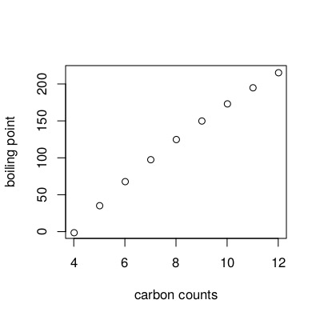
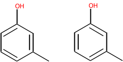
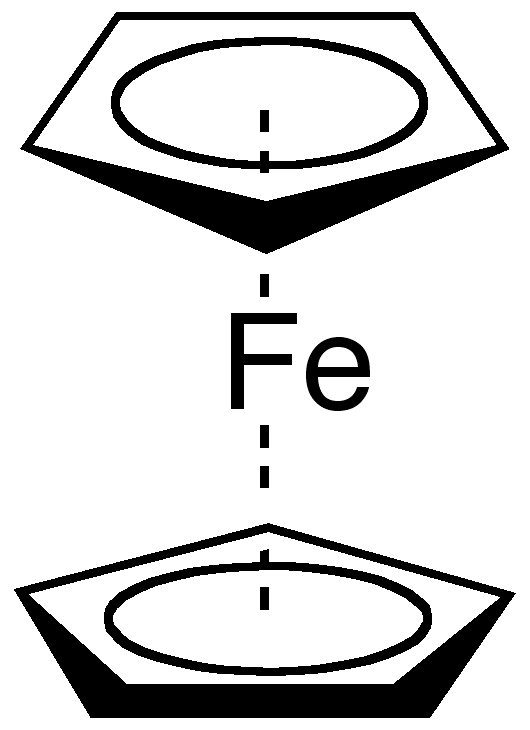

# Cheminformatics

*Note: this chapter is an evolved version of a chapter of [my PhD
thesis](https://tools.wmflabs.org/scholia/work/Q25713029).*

While the purpose of this book is not to educate in <a name="tp1">cheminformatics</a> (see Chapter [1](introduction.md#sec:intro)),
this chapter provides minimal information about the representation of molecules and molecular systems.
Such a representation is needed to allow analysis and manipulation of chemical
structures in the computer. This is of paramount importance in areas like
drug design, synthesis planning, property prediction, crystal structure engineering,
structure elucidation, searching in chemical literature, exchange of chemical knowledge,
and structure elucidation.

Many different representations have been developed, each capturing different
bits of information about the molecular system under study. Unfortunately,
in many cases it is unclear which part of the information is essential for a
certain application. For example, although the <a name="tp2">boiling points</a> correlates well
with the number of carbon atoms in a homologous series of alkanes [<a href="#citeref1">1</a>]
(see Figure [2.1](#fig:bp:alkanes)), the
carbon count descriptor is not generally useful for
predicting other properties, or even the same property for a more diverse set
of molecules. From simple physico-chemical principles, it is clear why this
is the case.

 **Figure 2.1**: Diagram showing the relation between the boiling point and the numberof carbon atoms in alkanes.

However, for more complex problems there is very little a-priori
knowledge that guides us in choosing appropriate descriptors. Nevertheless,
in certain areas specific habits have evolved; for example, a large part of the
quantitative structure-activity and structure-property relationship (<a name="tp3">QSAR</a> and
<a name="tp4">QSPR</a>) community routinely calculates hundreds or thousands of simple molecular
descriptors, and uses various variable-selection techniques to extract the most
useful ones. Unfortunately, validation of this process is almost
impossible due to the small size of data sets. It would a giant leap forward
if we could say beforehand, based on the characteristics of the molecular system
and our aim, what descriptors would be most informative.
This is currently, however, still too far-fetched. Therefore, we are forced to
judge the quality of the representation on the basis on the quality of the
prediction: if we are able to correctly predict properties of new compounds,
then we conclude that the representations contains relevant information.

This chapter describes the role of representation in modeling properties of
molecular systems of organic molecules and in the exchange of molecular
information. The
following paragraphs give an overview on useful representations.

## Molecular Representations

The two most common methods to represent organic molecules are the (systematic)
name and the 2D drawing of the molecule. They identify the molecule of interest,
but cannot be used for machine processing. To prevent ambiguities,
conventions describing how molecules should be named and drawn are needed. <a name="tp5">IUPAC name</a>
recommendations, and <a name="tp6">line notations</a> such as the
<a name="tp7">Wiswesser Line Notation</a> [<a href="#citeref2">2</a>] and the
<a name="tp8">SMILES</a> [<a href="#citeref3">3</a>],
are examples for standardized conventions
for labeling molecules (see Section [11.7](io.md#sec:lineNotations)).
In addition, these representations do not include
information on the 3D conformation.

The systemic naming conventions are based on chemical graphs, which represent
atoms as vertices and bonds as edges, defining the exact connectivity within the
molecule. For example, IUPAC recommended names, such as 2-butanol, number
attachment points based on <a name="tp9">graph theory</a>.
In combination with 3D coordinate information, many
descriptors have been developed to capture particular features of the molecules
and more complex systems, like reactions, crystal structures and protein-ligand
complexes. For example, in reaction classification the difference in chemical
graphs between reactants and products is used, and docking of ligands in the
active site of proteins uses force fields to calculate binding energy, using a
combination of 3D coordinates and the graph representation.

At the other end of the scale we find <a name="tp10">quantum chemical descriptors</a>, which
in detail represent the 3D molecular information. Here, atoms are represented by
atomic orbitals centered on points in 3D space. The molecular bonding is
represented by hybridization of atomic orbitals into molecular orbitals.
The disadvantage of this method is the need to find a balance between accuracy
and the required computing power. Approximations can be made to reduce the
<a name="tp11">complexity</a> of the calculations, leading to semi-empirical methods like MNDO and
AM1. These methods are faster but less accurate at the same time.

Force fields provide even faster energy calculations based on 3D conformations. <!-- <a name="tp12">force field</a> -->
They use a representation of molecules where atomic coordinates are complemented
by rules that approximate the
energy of the system based on contributions from interactions between two, three
and four atoms (bond, angle and <a name="tp13">torsion</a> interactions). The contributions are
based on physical laws where the parameters are derived from
experimentally determined molecular properties. While not as accurate as quantum
chemistry, it is much faster and allows to analyze much larger systems, like
protein structures, crystal structures and dynamical chemical processes.
The accuracy strongly depends on the parametrization of the rules that
approximate the interactions. Force fields have the disadvantage that this
\topic{parametrization} has to be repeated for each new class of molecules and type of
molecular system.

The next two sections discuss applications of graph-based representations in
data analyses and in property databases, and give more details on the use
of quantum chemistry as representation. The sections following these
discuss the need and use of numerical representations.

## Chemical Graphs

Graph-based representations are popular because they represent
chemical structures in a rather intuitive way, although simplistic:
molecules are atoms held together by bonds, and certain atom groups (functional
groups) give rise to certain molecular properties. For example, an acid group
reduces the pKa of the molecule and makes the molecule react with an amine.
Searching a functional group in a molecule corresponds to finding a
subgraph in the chemical graph [<a href="#citeref4">4</a>,<a href="#citeref5">5</a>],
when the molecule is considered a graph where atoms are vertices and bond edges.

The <a name="tp14">chemical graph</a> also allows the use of canonization methods, such as the Morgan
algorithm [<a href="#citeref6">6</a>]. Using these methods, line notations can be developed which are unique
for a molecule, making the look-up of molecular structures in databases much
easier. The Wiswesser Line Notation is one of such  notations, but nowadays the
SMILES line notation is most used. However, the canonization algorithm used to
generate canonical SMILES has never been published and cannot generally be used
as unique molecular identifier.

 **Figure 2.2**: 2D diagrams of the two possible resonance structures of a compound with a phenyl ring. Both diagrams refer to the same compounds, but the depicted graph representations are not identical.

The use of these line notations and the substructure searching has allowed setting
up <a name="tp15">databases</a> with molecular structures and their properties. For example,
the PDB database contains crystal structures of
proteins, nucleic acids and their complexes with ligands [<a href="#citeref7">7</a>].
Other databases contain physical properties [<a href="#citeref8">8</a>[, 13C and 1H
NMR [<a href="#citeref9">9</a>], and IR spectra [<a href="#citeref10">10</a>].
The <a name="tp16">Chemical Abstracts Service</a> (<a name="tp17">CAS</a>) maintains a substance database with millions of chemical
substances extracted from literature. In 2008 this number increased by about
4000 entries each year. However, only for a fraction of these compounds more
information is available in other
curated databases. For example, the <a name="tp18">Cambridge Structural Database</a>
(<a name="tp19">CSD</a>) had 400 thousand registered compounds (~1.3%) with associated crystal
structures in 2008, and that number increases by only
30 thousand structures each year [<a href="#citeref11">11</a>]. Moreover, the
increase in information in literature is estimated at even 1~million new compounds
per year from more than 700 thousand articles in chemistry-related literature [<a href="#citeref12">12</a>].
In addition to these proprietary databases, open-access databases have emerged,
such as PubChem [<a href="#citeref13">13</a>] and ZINC [<a href="#citeref14">14</a>].

These chemical graph-based databases have found many applications, such as systems for synthesis
planning, where reactions are represented as changes in
the molecular graph when going from reactant to the product side [<a href="#citeref15">15</a>].
An example of
such a tool is the Organic Chemical Simulation of Syntheses (OCSS) [<a href="#citeref16">16</a>],
which mimics the process of retro-synthetic synthesis planning. This has led to a number of
computer-assisted synthesis design (CASD) systems, such as the LHASA system,
noteworthy because it used a large knowledge base extracted from
literature [<a href="#citeref17">17</a>].

Another important application of chemical graphs is the use in structure
generation, which fulfills a crucial role in <a name="tp20">computer-aided structure elucidation</a> (<a name="tp21">CASE</a>).
DENDRAL is an example CASE system that elucidated molecular structures using
mass spectra [<a href="#citeref18">18</a>].  It derived graph constraints from the input
spectrum and the molecular formula, and then generated possible
structures, each of which was evaluated by comparing a predicted spectrum with
the experimental one. The best spectral match was proposed as elucidated structure.
The same approach is used for NMR-based CASE, where, in addition to the structure
generation, graph theory is used to describe molecular fragments using alphanumeric
codes, of which the HOSE code [<a href="#citeref19">19</a>] is still widely used. Correlation
of these codes with chemical shifts provides a cheap but effective method for
predicting NMR spectra.

However, while the application of graph theory in chemistry has shown to be
quite powerful, it is unable to reflect to full chemistry that can be found in
molecules. Consider the benzene derivative diagrams shown in
Figure [2.2](#fig:benzene). The two diagrams show non-identical graphs, but refer
to the same molecular compound; the only difference is that of the resonance
structures of the phenylic ring.

Organometallic compounds are excellent examples of another class of molecules that
are difficult to represent using chemical graphs:
they involve complex delocalized bonding systems. Ferrocene, shown in <!-- <a name="tp22">ferrocene}</a> -->
Figure [2.3](#fig:ferrocene), is an organometallic compound where two cyclopentadienyl
fragments are bound to the iron. No classical two electron bonds can be drawn between
the iron and any of the carbons; instead, the two six-electron π-systems of the
cyclopentadienyl rings that bind to the iron. In the nineties several alternative
approaches have been suggested to address this
problem [<a href="#citeref20">20</a>,<a href="#citeref21">21</a>,<a href="#citeref22">22</a>].

 **Figure 2.3**: 2D diagram of ferrocene, which, like all organometallic compounds, is difficult to represent with classical chemoinformatics approaches.

## Quantum Chemistry

Quantum mechanics offers an alternative to chemical graphs as representation of
molecular species. Early in the 20th century it was discovered that it can
accurately describe chemical and physical properties of molecules.

Quantum chemistry takes advantage of the knowledge that electrons are not randomly <!-- <a name="tp23">quantum chemistry</a>
distributed around the nuclei to which they are bound. Instead, their motion can
be accurately described by a wave model, due to the fact that any particle both
behaves as particle as well as a wave function. Now, molecular properties, or any
chemical or physical property in general, can be calculated
by solving the Schrödinger equation.

This leads to the exact electronic structure of the matter under study, from which
any property can be calculated in arbitrary accuracy. After development of this
theoretical method it was even claimed everything in chemistry was now understood;
Dirac wrote [<a href="#citeref23">23</a>]:

<ul><i>
The underlying physical laws necessary for the mathematical theory of a large part
of physics and the whole of chemistry are thus completely known, and the difficulty
is only that the exact application of these laws leads to equations much too
complicated to be soluble.
</i></ul>

Indeed, since the quantum mechanical description of matter is a function of all
electrons and all nuclei *and* their interactions, the complexity scales
rather unfortunately with the number of atoms `N`. Several approximations can be
made to reduce the mathematical <a name="tp24">complexity</a>, but the calculations still
scale as `N^4`, or even `N^8` for more precise calculations [<a href="#citeref24">24</a>]. 
This means that the calculation for a molecule
twice as large as ethanol, takes 16 up to 256 times as long. A small biochemically
relevant molecule, e.g. nonane-4,6-dione, with only three times as many atoms, takes
81 up to 6561 times as long. Nevertheless, properties of even more complex molecules can
now be calculated within hours or days. However, for current practices, like virtual screening,
this is practically infinitely long. When going beyond small molecules, such as
reaction mechanisms, and protein binding, the calculations become impossible.

Because neither chemical graph and quantum chemistry are practically useful for
the much-needed prediction of physical, chemical and biological properties, 
many other representations of molecules and molecular systems have been developed.
The following section discusses a class of numerical representations, which are
often based on graph or quantum chemical representations, but focused to capturing
molecular information relevant to the data analyzed or modeled.

## References

1. Wiener H. Correlation of Heats of Isomerization, and Differences in Heats of Vaporization of Isomers, Among the Paraffin Hydrocarbons. Journal of the American Chemical Society. 1947 Jan 1;69(11):2636–8.  doi:[10.1021/JA01203A022](https://doi.org/10.1021/JA01203A022)
2. Wiswesser WJ. How the WLN began in 1949 and how it might be in 1999. Journal of Chemical Information and Modeling. 1982 May 1;22(2):88–93.  doi:[10.1021/CI00034A005](https://doi.org/10.1021/CI00034A005)
3. Weininger D. SMILES, a chemical language and information system. 1. Introduction to methodology and encoding rules. Journal of Chemical Information and Modeling [Internet]. 1988 Feb 1;28(1):31–6. Available from: http://organica1.org/seminario/weininger88.pdf doi:[10.1021/CI00057A005](https://doi.org/10.1021/CI00057A005)
4. LC R, RA K. Finding Chemical Records by Digital Computers. Science. 1957 Oct 1;126(3278):814–9.  doi:[10.1126/SCIENCE.126.3278.814](https://doi.org/10.1126/SCIENCE.126.3278.814)
5. Ullmann JR. An Algorithm for Subgraph Isomorphism. Journal of the ACM. 1976 Jan 1;23(1):31–42.  doi:[10.1145/321921.321925](https://doi.org/10.1145/321921.321925)
6. Morgan HL. The Generation of a Unique Machine Description for Chemical Structures-A Technique Developed at Chemical Abstracts Service. Journal of Chemical Documentation. 1965 Jan 1;5(2):107–13.  doi:[10.1021/C160017A018](https://doi.org/10.1021/C160017A018)
7. Berman HM, Henrick K, Nakamura H. Announcing the worldwide Protein Data Bank. Nature structural biology. 2003 Jan 1;10(12):980.  doi:[10.1038/NSB1203-980](https://doi.org/10.1038/NSB1203-980)
8. Linstrom JL, Mallard WG. NIST Chemistry WebBook; NIST Standard Reference Database No. 69, Gaithersburg MD, 2001
9. Steinbeck C, Kuhn S. NMRShiftDB – compound identification and structure elucidation support through a free community-built web database. Phytochemistry. 2004 Jan 1;65(19):2711–7.  doi:[10.1016/J.PHYTOCHEM.2004.08.027](https://doi.org/10.1016/J.PHYTOCHEM.2004.08.027)
10. YAMAMOTO O, SOMENO K, WASADA N, HIRAISHI J, HAYAMIZU K, TANABE K, et al. An integrated spectral data base system including IR, MS, 1H-NMR, 13C-NMR, ESR and Raman spectra. Analytical Sciences. 1988 Jan 1;4(3):233–9.  doi:[10.2116/ANALSCI.4.233](https://doi.org/10.2116/ANALSCI.4.233)
11. Allen FH, FH A. The Cambridge Structural Database: a quarter of a million crystal structures and rising. Acta Crystallographica Section B: Structural Science. 2002 May 29;58(3):380–8.  doi:[10.1107/S0108768102003890](https://doi.org/10.1107/S0108768102003890)
12. Engel T. Basic overview of chemoinformatics. Journal of Chemical Information and Modeling. 2006 Nov 1;46(6):2267–77.  doi:[10.1021/CI600234Z](https://doi.org/10.1021/CI600234Z)
13. Austin CP, Brady LS, Insel TR, Collins F. NIH Molecular Libraries Initiative. Science. 2004 Nov 1;306(5699):1138–9.  doi:[10.1126/SCIENCE.1105511](https://doi.org/10.1126/SCIENCE.1105511)
14. Irwin JJ, Shoichet BK. ZINC--a free database of commercially available compounds for virtual screening. Journal of Chemical Information and Modeling. 2005 Jan 1;45(1):177–82.  doi:[10.1021/CI049714+](https://doi.org/10.1021/CI049714+)
15. Blair J, Gasteiger J, Gillespie C, Gillespie PD, Ugi I. Representation of the constitutional and stereochemical features of chemical systems in the computer assisted design of syntheses. Tetrahedron. 1974 Jan 1;30(13):1845–59.  doi:[10.1016/S0040-4020(01)97318-1](https://doi.org/10.1016/S0040-4020(01)97318-1)
16. Corey EJ, Wipke WT. Computer-Assisted Design of Complex Organic Syntheses. Science. 1969 Oct 10;166(3902):178–92.  doi:[10.1126/SCIENCE.166.3902.178](https://doi.org/10.1126/SCIENCE.166.3902.178)
17. Corey EJ, Wipke WT, Cramer RD, Howe WJ. Computer-assisted synthetic analysis. Facile man-machine communication of chemical structure by interactive computer graphics. Journal of the American Chemical Society. 1972 Jan 1;94(2):421–30.  doi:[10.1021/JA00757A020](https://doi.org/10.1021/JA00757A020)
18. Lederberg J. How DENDRAL was conceived and born. 1987 Jan 1;5–19.  doi:[10.1145/41526.41528](https://doi.org/10.1145/41526.41528)
19. Bremser W. HOSE — a novel substructure code. Analytica Chimica Acta. 1978 Jan 1;103(4):355–65.  doi:[10.1016/S0003-2670(01)83100-7](https://doi.org/10.1016/S0003-2670(01)83100-7)
20. Dietz A. Yet Another Representation of Molecular Structure. Journal of Chemical Information and Modeling. 1995 Sep 1;35(5):787–802.  doi:[10.1021/CI00027A001](https://doi.org/10.1021/CI00027A001)
21. Konstantinova EV, Skorobogatov VA. Molecular Hypergraphs: The New Representation of Nonclassical Molecular Structures with Polycentric Delocalized Bonds. Journal of Chemical Information and Modeling. 1995 May 1;35(3):472–8.  doi:[10.1021/CI00025A015](https://doi.org/10.1021/CI00025A015)
22. Bauerschmidt S, Gasteiger J. Overcoming the Limitations of a Connection Table Description: A Universal Representation of Chemical Species. Journal of Chemical Information and Modeling. 1997 Jan 1;37(4):705–14.  doi:[10.1021/CI9704423](https://doi.org/10.1021/CI9704423)
23. Dirac PAM. Quantum Mechanics of Many-Electron Systems. Proceedings of the Royal Society A. 1929 Apr 6;123(792):714–33.  doi:[10.1098/RSPA.1929.0094](https://doi.org/10.1098/RSPA.1929.0094)
24. Missing

