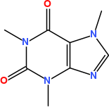

# Chemistry Toolkit Rosetta

The [Chemistry Toolkit Rosetta](http://ctr.wikia.com/) (CTR) wiki was set up some time ago by Andrew Dalke to
demonstrate how certain basic cheminformatics tasks are done in the various cheminformatics toolkits around.
This chapter shows how CTR tasks can be solved with the CDK in Groovy. Each section discusses one CTR task,
and show one possible solution.

The data used in this chapter originates from the wiki, and is redistributed with this book under the
CC-BY-SA license, as it is in the wiki.

## Heavy atom counts from an SD file

This tasks starts with an SD file (see Section XX) and counts for each structure in the file
the number of heavy atoms (non-hydrogen atoms). Because we simply handle the structures one by one,
the solution uses the `IteratingSDFReader` reader. The input file (`benzodiazepine.sdf.gz`) is a
gzipped file, which we handle by using a `GZIPInputStream` as outlined in Section XX.
Because we want to make sure the input file does not have any unexpected content, we use the `STRICT`
mode, detailed in Section XX. The input file turns out to do not have non-standard
features, so that we do not have to worry about D and T element symbols.

The solution lists all heavy atom counts:

<code>CTR1</code>

  
**Figure 20.1**: 2D diagram of caffeine.

## Depict a compound as an image

The CTR asks in this task an approach to take a SMILES string, generate 2D coordinates, and depict the result
in a PNG image. Chapter XX describes the last step, and for the first and second step
we use the `SmilesParser` and `StructureDiagramGenerator` classes, respectively.
The solution does not render the structure's title.

The solution can then look like, resulting roughly in Figure 20.1 for the SMILES of
caffeine in this example:

<code>CTR2</code>
