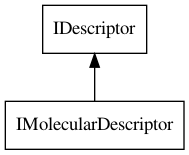
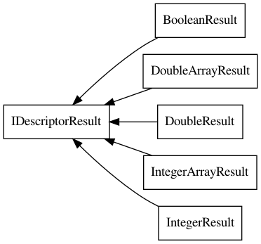

# Molecular Descriptors

The previous chapter discussed prediction of molecular properties. Understanding
them is a core aspect of chemistry. Computational tools help here. Quantum
Chemistry promises to calculate many molecular properties accurately from
mere knowledge of atom locations and their electronic properties, but suffers
from a badly scaling algorithm. Instead, approaches using the chemical graph
as a core representation are less accurate, but much more faster.

Quantitative Structure-Activity Relationship (<a name="tp1">QSAR</a>) modeling uses this latter
approach to predict molecular properties. QSAR
approaches commonly use <a name="tp2">molecular descriptors</a> which numerically
describe molecular allowing statistical methods to correlate these descriptors
to end points, such as the logP property. A far more detailed explanation
can be found in [<a href="#citeref1">1</a>].

This chapter will discuss the descriptor API present in the CDK to calculate
molecular descriptors. It should be noted that the CDK also contains atom,
atom pair, bond, and protein descriptors, using a similar API.

## Descriptors and Specifications

The CDK makes a distinction between descriptor specifications and their
implementations. The reason is simple: the CDK has implementations of
descriptor specifications. Such an implementation may depend on data
available in the CDK, such as isotopic masses which get more accurate
over time. Consequently, the calculated properties will deviate when
this data gets updated: the descriptor implementation changes even when
the algorithm stays the same.

Practically, things are even a bit more complicated, as the CDK is
different in another way. The CDK project decided it was better to have
parameterizable implementations: one descriptor instance that can calculate
the number of carbons, but also the number of nitrogens. After all,
we do not want too much code replication.

Therefore, the CDK has two core interfaces: [`IDescriptor`](http://cdk.github.io/cdk/latest/docs/api/org/openscience/cdk/qsar/IDescriptor.html) and
[`IImplementationSpecification`](http://cdk.github.io/cdk/latest/docs/api/org/openscience/cdk/IImplementationSpecification.html) [<a href="#citeref2">2</a>]. The first is an actual
descriptor instance,
parameterized to calculate particular output. The second links this
descriptor to a formal specification, outlined in the Blue Obelisk
Descriptor Ontology [<a href="#citeref3">3</a>,<a href="#citeref4">4</a>].

### IImplementationSpecification

Let's first look at the [`IImplementationSpecification`](http://cdk.github.io/cdk/latest/docs/api/org/openscience/cdk/IImplementationSpecification.html) interface.
This <a name="tp3">specification</a> interface provides provenance information that allows you to keep
track how your descriptor values were calculated. Of course, you may
simply ignore that whenever you do not need that information.

This interfaces defines four fields:
* specification reference
* implementation title
* implementation identifier
* implementation vendor

This information links the CDK descriptor implementation to a formally
defined descriptor algorithm, pointed to by the specification reference.
The other three fields provide information on the CDK implementation,
allowing one to mix descriptor calculation by various tools and to keep
track of what value came from what vendor.

For example, we can inspect these field values for the TPSA descriptor
(see Section [17.3](properties.md#sec:tpsa)):

**<a name="script:TPSASpecs">Script 17.1</a>** [code/TPSASpecs.groovy](code/TPSASpecs.code.md)
```groovy
descriptor = new TPSADescriptor()
specs = descriptor.specification
println "Title: " + specs.implementationTitle
println "Reference: " + specs.specificationReference
println "Vendor: " + specs.implementationVendor
println "Identifier: " + specs.implementationIdentifier
```

This code provides us with these details:

```plain
Title: org.openscience.cdk.qsar.descriptors.mole...
  cular.TPSADescriptor
Reference: http://www.blueobelisk.org/ontologies...
  /chemoinformatics-algorithms/#tpsa
Vendor: The Chemistry Development Kit
Identifier: 2.8
```

The identifier values originally referred to a String which held the
source code repository's commit number. But ever since we moved from
a Subversion source code repository to Git, we no longer had commit
numbers, but commit hashes again. But both identifiers have the
function that they identified a specific revision of the implementation
allowing people to accurately recalculate that descriptor value,
given the same input. Well, no one seems to worry about that much,
but it is with this framework possible anyway.

## IDescriptor

As the previous code example (Script ??) shows, the
specification is for an descriptor implementation and we used
the `getSpecification()` (`.specifiction` in Groovy)
to get the specification information. This method is defined by
the [`IDescriptor`](http://cdk.github.io/cdk/latest/docs/api/org/openscience/cdk/qsar/IDescriptor.html) interface.

The interface introduces the following additional methods:
* `getDescriptorNames()`
* `getParameterNames()`
* `getParameterType(String name)`
* `setParameters(Object[] params)`
* `getParameters()`

The CDK descriptor API differs from other tools in that it structures descriptors
around the algorithms that calculate them. Therefore, each descriptor returns one
or more descriptor values. The first methods lists the descriptor value names, and
it should be noted that those are specifically for the used <a name="tp4">parameters</a>, as we will
see later. The default descriptor value names are listed in Appendix [C.5](appmoldescs.md#sec:moldescs:mol).

The next two methods, `getParameterNames()` and `getParameterType(String name)`,
allow us to discover which parameters a particular descriptor has, if any. For example,
we can check those of the [`AtomCountDescriptor`](http://cdk.github.io/cdk/latest/docs/api/org/openscience/cdk/qsar/descriptors/molecular/AtomCountDescriptor.html):

**<a name="script:AtomCountDescriptorParams">Script 17.2</a>** [code/AtomCountDescriptorParams.groovy](code/AtomCountDescriptorParams.code.md)
```groovy
descriptor = new AtomCountDescriptor()
descriptor.parameterNames.each { name ->
  type = descriptor.getParameterType(name).class.name
  println "$name -> $type"
}
```

which tells us how we can tune the descriptor calculation (see also Section [18.5](#sec:noCount)):

```plain
elementName -> java.lang.String
```

The last two methods allow is to change the current parameter values
(`setParameters(Object[] params)`), and what those active values are
(`getParameters()`). These values are in the same order as the parameter
names. For example, we can see if the [`AromaticAtomsCountDescriptor`](http://cdk.github.io/cdk/latest/docs/api/org/openscience/cdk/qsar/descriptors/molecular/AromaticAtomsCountDescriptor.html) calculates
aromaticity itself by default:

**<a name="script:AromaticAtomCountDescriptorParams">Script 17.3</a>** [code/AromaticAtomCountDescriptorParams.groovy](code/AromaticAtomCountDescriptorParams.code.md)
```groovy
descriptor = new AromaticAtomsCountDescriptor()
println "Values:"
descriptor.parameters.each { param ->
  type = param.class.name
  println "$type -> $param"
}
println "Updating the value..."
Object[] newValues = [ Boolean.TRUE ]
descriptor.setParameters(newValues)
println "New values:"
descriptor.parameters.each { param ->
  type = param.class.name
  println "$type -> $param"
}
```

Note that I used the Groovy syntax to create an array here, because the Java syntax overlaps
with the Groovy syntax for specifying closures [<a href="#citeref5">5</a>]. This code shows
us:

```plain
Descriptor names:
checkAromaticity -> java.lang.Boolean

Values:
java.lang.Boolean -> false

Updating the value...

New values:
java.lang.Boolean -> true
```

## IMolecularDescriptor

With this information about the descriptor now clear, it is time to look at a descriptor
value calculation. A molecular descriptor in the CDK is symbolized by the
[`IMolecularDescriptor`](http://cdk.github.io/cdk/latest/docs/api/org/openscience/cdk/qsar/IMolecularDescriptor.html) interface, which extends the [`IDescriptor`](http://cdk.github.io/cdk/latest/docs/api/org/openscience/cdk/qsar/IDescriptor.html) interface,
as shown in Figure [18.1](#fig:descriptorInheritance).

<a name="fig:descriptorInheritance"></a>

<br />**Figure 18.1**: The IDescriptor interface has a few derived interfaces, but only IMolecularDescriptor is shown here.

The relevant method now is the `calculate(IAtomContainer)` method, which returns
a [`DescriptorValue`](http://cdk.github.io/cdk/latest/docs/api/org/openscience/cdk/qsar/DescriptorValue.html). This class is returned rather than a double, because descriptors
can calculate multiple types. The most common two types are a single `Double` and
a `Double[]`, followed by the integer variants. However, a descriptor could also
return a cardinal value, and a boolean. But before we go into the details of the
actually calculated descriptor values, let's look at TPSA calculation in a bit more detail
then we did in Script ??:

**<a name="script:TPSACalc">Script 17.4</a>** [code/TPSACalc.groovy](code/TPSACalc.code.md)
```groovy
descriptor = new TPSADescriptor()
result = descriptor.calculate(oxazone)
println "Specification: " + result.specification
println "Parameters names: " + result.parameterNames
println "Parameters values: " + result.parameters
println "Exception: " + result.exception
println "Names: " + result.names
value = result.getValue()
```

The output shows us that quite some metadata is preserved:

```plain
Specification: org.openscience.cdk.qsar.Descript...
  orSpecification@241fc278
Parameters names: [checkAromaticity]
Parameters values: [false]
Exception: null
Names: [TopoPSA]
```

The descriptor specification is kept for reference, as well as the parameters, and the
descriptor value names. This is all the information you need to report in a publication
so that other people can recalculate the exact values you calculated.

Additionally, if the calculation failed (because the input structure
had error, had missing information, like no 3D coordinates), then an <a name="tp5">exception</a> is stored
and returned too:

**<a name="script:DescriptorCalcException">Script 17.5</a>** [code/DescriptorCalcException.groovy](code/DescriptorCalcException.code.md)
```groovy
descriptor = new MomentOfInertiaDescriptor()
result = descriptor.calculate(oxazone)
exception = result.exception
println "Exception:\n" + exception
```

The <a name="tp6">moment of inertia</a> descriptor requires 3D coordinates, which are not provided
in the above script. Therefore, we get an exception:

```plain
Exception:
org.openscience.cdk.exception.CDKException: Mole...
  cule must have 3D coordinates
```

## IDescriptorResult

With all this context described, it is time to look at the actual calculated values. It was
already noted that a molecular descriptor implementation in the CDK returns one or more values,
each of which can be of a varying type. Indeed, if we look at Appendix [C.5](appmoldescs.md#sec:moldescs:mol)
we see that some descriptors return one numerical value, while others return many values.
It should also be noted, that depending on parameter values set, the actual number of
calculated numbers can vary!

**<a name="script:DescriptorResultLength">Script 17.6</a>** [code/DescriptorResultLength.groovy](code/DescriptorResultLength.code.md)
```groovy
descriptor = new MomentOfInertiaDescriptor()
result = descriptor.calculate(methane)
value = result.value
println "Calculated values: " + value.length()
```

Which shows us that the molecular inertia descriptor calculates more than one value:

```plain
Calculated values: 7
```

The [`IDescriptorResult`](http://cdk.github.io/cdk/latest/docs/api/org/openscience/cdk/qsar/result/IDescriptorResult.html) interface is currently implemented by various classes,
outlined in Figure [18.2](#fig:descriptorResults). Each of the classes has a slightly different
API to get the actual values. The [`IntegerResult`](http://cdk.github.io/cdk/latest/docs/api/org/openscience/cdk/qsar/result/IntegerResult.html), [`DoubleResult`](http://cdk.github.io/cdk/latest/docs/api/org/openscience/cdk/qsar/result/DoubleResult.html),
and [`BooleanResult`](http://cdk.github.io/cdk/latest/docs/api/org/openscience/cdk/qsar/result/BooleanResult.html) classes have the methods `intValue()`,
`doubleValue()`, and `booleanValue()` respectively.

<a name="fig:descriptorResults"></a>

<br />**Figure 18.2**: The IDescriptorResults interface has several implementation, each wrapping calculated descriptor values.

The two array variants, [`IntegerArrayResult`](http://cdk.github.io/cdk/latest/docs/api/org/openscience/cdk/qsar/result/IntegerArrayResult.html) and [`DoubleArrayResult`](http://cdk.github.io/cdk/latest/docs/api/org/openscience/cdk/qsar/result/DoubleArrayResult.html),
work slightly different, and both provide a `get(int)` method to iterate over all
values. For example, for the molecular inertia descriptor values for methane it would
look like:

**<a name="script:DoubleArrayGetValue">Script 17.7</a>** [code/DoubleArrayGetValue.groovy](code/DoubleArrayGetValue.code.md)
```groovy
value = descriptor.calculate(methane).value
for (i in 0..(value.length()-1)) {
  println i + " " + value.get(i)
}
```

This returns us all inertia values, and note that the index starts at zero:

```plain
0 3.1955750763324886
1 3.1945914391012566
2 3.1941764686200322
3 1.0003079070516474
4 1.0004378617544136
5 1.0001299147011136
6 1.1190669469245764
```

<a name="sec:noCount"></a>
## Counting Nitrogens and Oxygens

Now that we know how the general API works, we can calculate custom descriptors, say the
`nitrogenCount` and `oxygenCount`. We reuse the [`AtomCountDescriptor`](http://cdk.github.io/cdk/latest/docs/api/org/openscience/cdk/qsar/descriptors/molecular/AtomCountDescriptor.html) for that, and
set the parameter:

**<a name="script:SpecificAtomCountDescriptor">Script 17.8</a>** [code/SpecificAtomCountDescriptor.groovy](code/SpecificAtomCountDescriptor.code.md)
```groovy
descriptor = new AtomCountDescriptor()
Object[] params = [ "N" ]
descriptor.setParameters(params)
calculated = descriptor.calculate(ethanol)
nitrogenCount = calculated.value
label = calculated.names[0]
println "Number of nitrogens ($label): $nitrogenCount"
params = [ "O" ]
descriptor.setParameters(params)
calculated = descriptor.calculate(ethanol)
oxygenCount = calculated.value
label = calculated.names[0]
println "Number of oxygens ($label): $oxygenCount"
```

And this returns us the nitrogen and oxygen counts:

```plain
Number of nitrogens (nN): 0
Number of oxygens (nO): 1
```

It should be noted too, that the descriptor labels, given in brackets in the output,
have been updated according to the change in descriptor parameters. This is not necessarily
the case for all descriptors, but many take this approach.

## References

1. <a name="citeref1"></a>Wikberg J, Eklund M, Willighagen E, Spjuth O, Lapins M, Engkvist O, et al. Introduction to Pharmaceutical Bioinformatics. 2018. 
2. <a name="citeref2"></a>Steinbeck C, Hoppe C, Hoppe C, Kuhn S, Floris M, Guha R, et al. Recent Developments of the Chemistry Development Kit (CDK) - An Open-Source Java Library for Chemo- and Bioinformatics. Curr Pharm Des [Internet]. 2006 Jun 1;12(17):2111–20. Available from: https://cdk.github.io/cdk-paper-2/ doi:[10.2174/138161206777585274](https://doi.org/10.2174/138161206777585274) ([Scholia](https://scholia.toolforge.org/doi/10.2174/138161206777585274))
3. <a name="citeref3"></a>Guha R, Howard MT, Hutchison GR, Murray-Rust P, Rzepa HS, Steinbeck C, et al. The Blue Obelisk-interoperability in chemical informatics. JCIM. 2006 Feb 22;46(3):991–8.  doi:[10.1021/CI050400B](https://doi.org/10.1021/CI050400B) ([Scholia](https://scholia.toolforge.org/doi/10.1021/CI050400B))
4. <a name="citeref4"></a>Spjuth O, Willighagen E, Guha R, Eklund M, Wikberg J. Towards interoperable and reproducible QSAR analyses: Exchange of datasets. J Cheminform. 2010;2(1):5.  doi:[10.1186/1758-2946-2-5](https://doi.org/10.1186/1758-2946-2-5) ([Scholia](https://scholia.toolforge.org/doi/10.1186/1758-2946-2-5))
5. <a name="citeref5"></a>[https://stackoverflow.com/questions/9363550/how-to-prevent-getting-a-groovy-boolean-in-an-object-array](https://stackoverflow.com/questions/9363550/how-to-prevent-getting-a-groovy-boolean-in-an-object-array)


