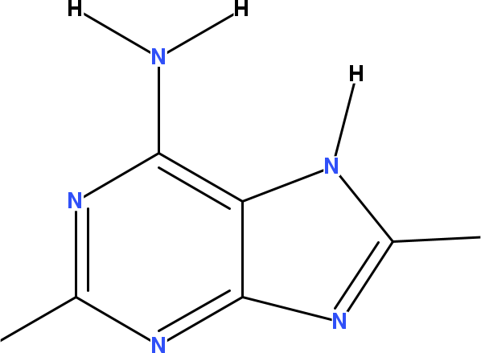

<a name="sec:inchi"></a>
# InChI

The IUPAC International Chemical Identifier (<a name="tp1">InChI</a>, 
[http://www.iupac.org/inchi/](http://www.iupac.org/inchi/)) is an identifier developed
to provide a database-independent, unique identifier for small organic
molecules [<a href="#citeref1">1</a>]. The CDK uses the <a name="tp2">JNI-InChI</a> library by Adams
([http://jni-inchi.sf.net/](http://jni-inchi.sf.net/)) to provides
a Java layer on top of the open source InChI library written in C.
The InChI is design to be unique for molecules, and one InChI always identifies
the same molecule, and as such is aimed to be used to look up molecules in
databases or on the internet [<a href="#citeref2">2</a>,<a href="#citeref3">3</a>].

To overcome the common problem caused by <a name="tp3">tautomerism</a> in database look up,
the InChI applies a number of rules to determine what the possible tautomers
for a particular chemical graph are. This makes it possible to find ethanal
in a database when the less-stable tautomer ethenol was searched. Both give
rise to the same InChI, as we will see later.

First, we need to see how we can generate InChIs in the CDK. It starts with
an [`InChIGeneratorFactory`](http://cdk.github.io/cdk/latest/docs/api/org/openscience/cdk/inchi/InChIGeneratorFactory.html) to create an [`InChIGenerator`](http://cdk.github.io/cdk/latest/docs/api/org/openscience/cdk/inchi/InChIGenerator.html). This
generator is then used to run the InChI software on the given molecule. The
algorithm might fail, for various reasons, and we need to check if the
generation succeeded too:

**<a name="script:InChIGeneration">Script 18.1</a>** [code/InChIGeneration.groovy](code/InChIGeneration.code.md)
```groovy
factory = InChIGeneratorFactory.getInstance();
generator = factory.getInChIGenerator(methane);
if (generator.getReturnStatus() == INCHI_RET.OKAY)
  print generator.getInchi()
```

which gives the InChI for methane:

```plain
InChI=1S/CH4/h1H4
```

This snippet of code has generated us a <a name="tp4">Standard InChI</a>. To explain
what a Standard InChI is, we first need to briefly look at the layers in
InChIs.

## Layers

An InChI is like an onion. No, not in the sense that it makes you
cry, but in the sense that is has layers {See *Shrek*).
Each layer adds more detailed information to the InChI of a molecule.
The aforementioned InChI for methane has a layer reflecting the molecular
formula (*/CH4*) and a hydrogen layer showing the number of
hydrogens for each atom (*/h1H4*). Except for the molecular formula
layer, most layers start with a lower case character, as is visible in the
hydrogen layer, indicated by the (*/h*).

Another important thing to note is that hydrogens are not explicitly
defined in the connection table (see Section [3.5](atomsbonds.md#sec:hydrogens)).
Therefore, the InChI for methane does not have a connectivity layer,
but formic acid, *mierezuur* in Dutch, does (*/c2-1-3*):

```plain
InChI=1S/CH2O2/c2-1-3/h1H,(H,2,3)
```

You see that the <a name="tp5">connectivity layer</a> shows how the atoms are connected, and
this layer it does not give bond orders. The atom numbering follows the molecular
formula, where the hydrogens are not numbered. Therefore, the carbon
has atom number 1, while the oxygens are atoms 2 and 3.

Now, have a careful look at this InChI for formic acid. Take a few minutes for
this, and make sure you fully understand the connectivity and hydrogen
layers (the answer is given in code snippet [18.2](#script:InChIMierezuurFixed)).

Other layers the InChI supports include those for, for example, stereochemistry.
The InChI software has a number of option to enable or disable certain layers.
This explains the existence of the <a name="tp6">Standard InChI</a>. This version of
the InChI is created when a particular set of layers is used, allowing the
InChI string to be used as <a name="tp7">unique identifier</a>: because it removes the
choice of layers, one molecule always has the same standard InChI, whereas
a molecule can have multiple InChI string depending on turning on or off certain
layers. However, it is of utmost importance to realize that a particular InChI
layer is always unique to the molecule, independent of layers being added
or removed.

A Standard InChI string is identified by the *1S* version number. If
non-standard layers are turned on, the version is simply *1*, as we will
see shortly.

### Fixed Hydrogens

If you had not cheated in the mierezuur exercise, you will have noted that one
hydrogen is delocalized: it can be attached to either of the oxygens. This
feature is picked up by the InChI algorithm to compensate for certain kinds
of <a name="tp8">tautomerism</a>. If we want to fix the hydrogens to a particular
atom, we use the following code:

**<a name="script:InChIMierezuurFixed">Script 18.2</a>** [code/InChIMierezuurFixed.groovy](code/InChIMierezuurFixed.code.md)
```groovy
factory = InChIGeneratorFactory.getInstance();
generator = factory.getInChIGenerator(
  mierezuur, "FixedH"
);
print generator.getInchi()
```

which results in this non-standard InChI:

```plain
InChI=1/CH2O2/c2-1-3/h1H,(H,2,3)/f/h2H
```

By adding the <a name="tp9">FixedH option</a> for the InChI algorithm, we added the
<a name="tp10">fixed hydrogen layer</a> (*/f/h2H*). This additional layer assigns
one mobile hydrogen to the second atom, which is the first oxygen.

<!-- <code>RenderAdenine</code> -->
<a name="fig:adenine"></a>

<br />**Figure 18.1**: 2D diagram of one of the tautomers of adenine.

### Stereoisomerism

Another interesting layer to look at is the <a name="tp11">stereoisomerism</a> layer. Particular,
because databases often disagree on the exact <a name="tp12">stereochemistry</a> of molecules, which is
weird but commonplace, unfortunately [Williams2012blog]. The standard InChIs for 
the two stereoisomers of bromo cholo fluoro methane result in two different InChIs:

**<a name="script:InChIStereoisomerism">Script 18.4</a>** [code/InChIStereoisomerism.groovy](code/InChIStereoisomerism.code.md)
```groovy
generator = factory.getInChIGenerator(isomer1)
println generator.inchi
generator = factory.getInChIGenerator(isomer2)
println generator.inchi
```

The differences are found in the stereochemistry related layers, `/t` and `/m`.
The first layer captures tetrahedral stereochemistry, while the other layer captures mirror
image. And because we started with two mirror image structures, the `/t` layer is
identical, and we the difference in the `/m` layer:

```plain
InChI=1S/CHBrClF/c2-1(3)4/h1H/t1-/m0/s1
InChI=1S/CHBrClF/c2-1(3)4/h1H/t1-/m1/s1
```

Because of the aforementioned database comparison argument, there is an important use case in
comparing InChIs without the stereochemistry layers. To create such InChIs, you can use the
<a name="tp13">SNon option</a>:

**<a name="script:InChINoStereoisomerism">Script 18.5</a>** [code/InChINoStereoisomerism.groovy](code/InChINoStereoisomerism.code.md)
```groovy
generator = factory.getInChIGenerator(
  isomer1, "Snon"
)
println generator.inchi
generator = factory.getInChIGenerator(
  isomer2, "Snon"
)
println generator.inchi
```

And then the InChIs for both structures are identical:

```plain
InChI=1S/CHBrClF/c2-1(3)4/h1H/t1-/m0/s1
InChI=1S/CHBrClF/c2-1(3)4/h1H/t1-/m1/s1
```

One important caveat: chiral information as read by the SMILES parser is not currently converted
into stereo information for the InChI generation process!


## References

1. <a name="citeref1"></a>Stein SE, Heller SR, Tchekhovski D. An Open Standard for Chemical Structure Representation: The IUPAC Chemical Identifier. Proceedings of the International Chemical Information Conference, 2003, pp 131-143.
2. <a name="citeref2"></a>Wohlgemuth G, Haldiya PK, Willighagen E, Kind T, Fiehn O. The Chemical Translation Service--a web-based tool to improve standardization of metabolomic reports. Bioinformatics. 2010 Oct 15;26(20):2647–8.  doi:[10.1093/BIOINFORMATICS/BTQ476](https://doi.org/10.1093/BIOINFORMATICS/BTQ476) ([Scholia](https://scholia.toolforge.org/doi/10.1093/BIOINFORMATICS/BTQ476))
3. <a name="citeref3"></a>Coles SJ, Day NE, Murray-Rust P, Rzepa HS, Zhang Y. Enhancement of the chemical semantic web through the use of InChI identifiers. Organic & Biomolecular Chemistry. 2005;3(10):1832.  doi:[10.1039/B502828K](https://doi.org/10.1039/B502828K) ([Scholia](https://scholia.toolforge.org/doi/10.1039/B502828K))


