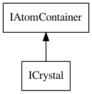

# Salts and other disconnected structures

In the Section [3.3](atomsbonds.md#sec:molecules) we saw how atoms and bonds are contained in
the `IAtomContainer` data model. It was mentioned that 
it is a general container, and this is exactly what we need for disconnected
structures like salts and molecular crystal structures.

Functionality to determine if the content of an IAtomContainer is
connected, you can use the `ConnectivityChecker`, as explained in
Section XXX.

## Salts

Salts are one of the most common disconnected structures found in compound
databases: a <a name="tp1">salt</a> is a combination of two or more connected molecules
bound to each other by coulombic interactions. These may be solids.

A common kitchen example is the table salt sodium chloride. We can
represent this using the following model:

**Script** [code/Salt.groovy](code/Salt.code.md)
```groovy
salt = new AtomContainer();
sodium = new Atom("Na");
sodium.setFormalCharge(+1);
chloride = new Atom("Cl");
chloride.setFormalCharge(-1);
salt.addAtom(sodium);
salt.addAtom(chloride);
```

If you prefer a single `IAtomContainer` to only contain connected
atoms, instead of unbound atoms as in this salt example, you can
partition them into two or more new containers, as explained in
Section XX.

 <br />
**Figure**: The `ICrystal` interface extends the `IAtomContainer` interface.

## Crystals

Of course, the representation given in the previous section
is a very basic model for sodium chloride. A <a name="tp2">crystal</a>
structure would perhaps be a more accurate description of what you
like to represent. In this case, the <a name="tp3">`ICrystal`</a> subclass of
the `IAtomContainer` can be used (see Figure `):

**Script** [code/SaltCrystal.groovy](code/SaltCrystal.code.md)
```groovy
salt = new Crystal();
sodium = new Atom("Na");
sodium.setFormalCharge(+1);
chloride = new Atom("Cl");
chloride.setFormalCharge(-1);
salt.addAtom(sodium);
salt.addAtom(chloride);
```

If we want to add the crystal structure parameters and crystal
structure coordinates of the atoms, we add can add them too (data
taken from [this webpage](http://www.ilpi.com/inorganic/structures/nacl/)):

**Script** [code/SaltCrystalParam.groovy](code/SaltCrystalParam.code.md)
```groovy
salt = new Crystal();
salt.setA(new Vector3d(5.6402, 0, 0));
salt.setB(new Vector3d(0, 5.6402, 0));
salt.setC(new Vector3d(0, 0, 5.6402));
salt.setZ(4);
sodium = new Atom("Na");
sodium.setFormalCharge(+1);
sodium.setFractionalPoint3d(
  new Point3d(0, 0, 0)
);
chloride = new Atom("Cl");
chloride.setFormalCharge(-1);
chloride.setFractionalPoint3d(
  new Point3d(0.5, 0.5, 0.5)
);
salt.addAtom(sodium);
salt.addAtom(chloride);
```

## References


