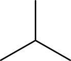

# Substructure Searching

The [`UniversalIsomorphismTester`](http://cdk.github.io/cdk/latest/docs/api/org/openscience/cdk/isomorphism/UniversalIsomorphismTester.html) class in the CDK can be used
for <a name="tp1">substructure searching</a>. It allows you to determine if some
structure is a substructure and what the
matching substructures are. As such, this can also be used to determine
if two structures are identical.

In this chapter we will see how the class returns all possible
substructure matches, and we'll notice that redundancy occurs due
to symmetrically equivalent matches, and how these redundant
matches can be removed.

<a name="sec:sec:exactsearch"></a>
## Exact Search

The [`UniversalIsomorphismTester`](http://cdk.github.io/cdk/latest/docs/api/org/openscience/cdk/isomorphism/UniversalIsomorphismTester.html) class implements an algorithm
that was originally developed for <a name="tp2">isomorphism</a> checking.
However, it can be used for substructure search too.
This section will first show how the class is used to
check if two classes are identical:

**<a name="script:Isomorphism">Script 20.1</a>** [code/Isomorphism.groovy](code/Isomorphism.code.md)
```groovy
butane = MoleculeFactory.makeAlkane(4);
isomorphismTester = new UniversalIsomorphismTester()
println "Is isomorphic: " +
  isomorphismTester.isIsomorph(
    butane, butane
  )
```

This algorithm works by looking the how bonds are connected to each
other. This is important to realize, because it explains a typical
corner case for this algorithm: it cannot distinguish cyclopropane
from isobutane (see Figure [17.1](#fig:cyclopropane:isobutane)) when
they are hydrogen depleted:

**Script** [code/UITLimitation.groovy](code/UITLimitation.code.md)
```groovy
isomorphismTester = new UniversalIsomorphismTester()
println "Is isomorphic: " +
  isomorphismTester.isIsomorph(
    cyclopropane, isobutane
  )
```

Fortunately, the CDK implementation has a workaround for this so that they are
still considered different, based on the fact that they have
different atom counts:

```plain
Is isomorphic: false
```

However, for substructure searching we're less lucky, as we will see shortly.


<a name="fig:cyclopropane:isobutane"></a>
 
<br />**Figure 17.1**: Cyclopropane (left) and isobutane (right).

<a name="sec:"></a>
## Substructures

Starting from the above code to match two structures, the step to substructure searching
is made via the `isSubgraph()` method:

**Script** [code/IsSubgraph.groovy](code/IsSubgraph.code.md)
```groovy
butane = MoleculeFactory.makeAlkane(4);
propane = MoleculeFactory.makeAlkane(3);
isomorphismTester = new UniversalIsomorphismTester()
println "Propane part of Butane: " +
  isomorphismTester.isSubgraph(
    butane, propane
  )
println "Butane part of Propane: " +
  isomorphismTester.isSubgraph(
    propane, butane
  )
```

It gives this output:

```plain
Propane part of Butane: true
Butane part of Propane: false
```

Now, you may wonder why propane is a subgraph of butane, because it is
indeed not. But while the variable names suggest that that is what we have been testing,
we have been testing something else: this code works because of the fact that the `MoleculeFactory`
returns hydrogen depleted graphs (see Section ??).
Therefore, butane is a chain of four carbons, and propane is a chain
of three carbons. Then, the latter is a chemical subgraph of the
former.

If we now return to our previous cyclopropane-isobutane example, we can run a subgraph
analysis on them too:

**Script** [code/UITSubgraphLimitation.groovy](code/UITSubgraphLimitation.code.md)
```groovy
isomorphismTester = new UniversalIsomorphismTester()
println "Cyclopropane part of isobutane: " +
  isomorphismTester.isSubgraph(
    isobutane, cyclopropane
  )
println "Isobutane part of cyclopropane: " +
  isomorphismTester.isSubgraph(
    cyclopropane, isobutane
  )
```

Here we do see the intrinsic limitation of the algorithm reflected. While it is
possible to see that isobutane has more atoms then cyclobutane and therefore cannot
be a substructure, that conclusion cannot be derived for cyclobutane as substructure
as isobutane, visualizing that algorithmic limitation:

```plain
Cyclopropane part of isobutane: true
Isobutane part of cyclopropane: false
```

<a name="sec:"></a>
## Matching Substructures

Substructure searching is finding in a target molecule the atoms that
match the given searched substructure. With the [`UniversalIsomorphismTester`](http://cdk.github.io/cdk/latest/docs/api/org/openscience/cdk/isomorphism/UniversalIsomorphismTester.html)
we can do:

**Script** [code/Overlap.groovy](code/Overlap.code.md)
```groovy
butane = MoleculeFactory.makeAlkane(4)
ccc = MoleculeFactory.makeAlkane(3)
isomorphismTester = new UniversalIsomorphismTester()
hits = isomorphismTester.getOverlaps(
  butane, ccc
)
println "Number of hits: " + hits.size()
hits.each { substructure ->
  println "Substructure in AtomContainer:"
  println "  #atoms: " + substructure.atomCount
}
```

However, this only returns us one match, selected as being the largest:

```plain
Number of hits: 1
Substructure in AtomContainer:
  #atoms: 3
```

There is an alternative:

**Script** [code/Substructure.groovy](code/Substructure.code.md)
```groovy
butane = MoleculeFactory.makeAlkane(4);
ccc = MoleculeFactory.makeAlkane(3);
isomorphismTester = new UniversalIsomorphismTester()
hits = isomorphismTester.getSubgraphAtomsMaps(
     butane, ccc
  )
println "Number of hits: " + hits.size()
hits.each { substructure ->
  println "Atoms in substructure: " +
    substructure.size()
}
```

The `getSubgraphAtomsMaps()` methods returns a `List<List<RMap>>`
object, where each `List<RMap>` represents on substructure match.
When we look at the outer list, we see that the subgraph of three carbon atoms
is found 4 times in butane, each with 3 atoms:

```plain
Number of hits: 4
Atoms in substructure: 3
Atoms in substructure: 3
Atoms in substructure: 3
Atoms in substructure: 3
```

This is caused by the symmetrical nature of the substructure. It can map
twice onto the same three atoms in butane: once in the forward direction,
and once in the backward direction.

<a name="sec:sec:smarts"></a>
## SMARTS matching

A common method to find substructures in cheminformatics is the
SMiles ARbitrary Target Specification (<a name="tp3">SMARTS</a>). The CDK has a
`SMARTSParser` class to parse SMARTS strings and a convenience tool to perform
SMARTS substructure searches. This is a typical use case:

**Script** [code/SMARTSSearching.groovy](code/SMARTSSearching.code.md)
```groovy
atomContainer = sp.parseSmiles("CC(=O)OC(=O)C");
querytool = new SMARTSQueryTool(
  "O=CO", atomContainer.getBuilder()
);
found = querytool.matches(atomContainer);
if (found) {
   int nmatch = querytool.countMatches();
   mappings = querytool.getMatchingAtoms();
   for (int i = 1; i <= nmatch; i++) {
      atomIndices = mappings.get(i-1);
      println "match $i: $atomIndices"
   }
}
```

This shows us that the SMARTS-encoded carboxylic acid substructure is found twice
and which atoms in the input structure form that match:

```plain
match 1: [2, 1, 3]
match 2: [5, 4, 3]
```

### Unique matches

Symmetry can cause identical hits to match multiple times, in different ways. This
is, for example, the case when we loosen the above substructure search to a carbon
connected to two oxygens, whatever the bond order is:

**Script** [code/SMARTSUniqueSearching.groovy](code/SMARTSUniqueSearching.code.md)
```groovy
atomContainer = sp.parseSmiles("CC(=O)OC(=O)C");
querytool = new SMARTSQueryTool(
  "O~C~O", atomContainer.getBuilder()
);
found = querytool.matches(atomContainer);
if (found) {
   mappings = querytool.getMatchingAtoms();
   for (int i = 1; i <= mappings.size(); i++) {
      atomIndices = mappings.get(i-1);
      println "match $i: $atomIndices"
   }
   mappings = querytool.getUniqueMatchingAtoms();
   for (int i = 1; i <= mappings.size(); i++) {
      atomIndices = mappings.get(i-1);
      println "unique match $i: $atomIndices"
   }
}
```

This shows the different between the `getMatchingAtoms` and `getUniqueMatchingAtoms`
method:

```plain
match 1: [2, 1, 3]
match 2: [3, 1, 2]
match 3: [3, 4, 5]
match 4: [5, 4, 3]
unique match 1: [2, 1, 3]
unique match 2: [3, 4, 5]
```

<a name="sec:descriptors:fingerprints"></a>
## Fingerprints

Substructure searching is a relatively slow algorithm, and the time required
to compare two molecules scales with the number of atoms in each molecule.
To reduce the computation time, <a name="tp4">molecular fingerprints</a> were
invented. There are two key aspects to fingerprints that make them
efficient: first, they have a fixed length so that the time to compare
two molecule is independent of the size of the two structures;
secondly, the fingerprint of a substructure always matches the
fingerprint of any molecules that has that substructure.

In this section we will see two fingerprint types available in the CDK:
a substructure based fingerprint, and a path based fingerprint.
Before I will explain how these fingerprints are created, we will first
look at the `BitSet` class that is used by the CDK to
represent these fingerprints. Consider this code:

**<a name="script:BitSetDemo">Script 15.1</a>** [code/BitSetDemo.groovy](code/BitSetDemo.code.md)
```groovy
bitset = new BitSet(10);
println "Empty bit set: $bitset";
bitset.set(3);
bitset.set(7);
println "Two bits set: $bitset";
```

If we analyze the output, we see that all set bits are listed, and
that all other bits are not: 

```plain
Empty bit set: {}
Two bits set: {3, 7}
```

Let us now consider a simple substructure fingerprint of length four
with the following bit definitions:

* bit 1: molecule contains a carbon
* bit 2: molecule contains a nitrogen
* bit 3: molecule contains a oxygen
* bit 4: molecule contains a chlorine

Let's call this fingerprinter `SimpleFingerprinter`:

**<a name="script:SimpleFingerprinter">Script 15.2</a>** [code/SimpleFingerprinter.java](code/SimpleFingerprinter.code.md)
```java
public class SimpleFingerprinter implements IFingerprinter {
  Map<String,Integer> map = new HashMap<String,Integer>() {{
    put("C", 1);
    put("N", 2);
    put("O", 3);
    put("Cl", 4);
  }};
  public BitSet getFingerprint(IAtomContainer molecule) {
    BitSet bitSet = new BitSet(getSize());
    for (IAtom atom : molecule.atoms()) {
      if (map.containsKey(atom.getSymbol()))
        bitSet.set(map.get(atom.getSymbol()));
    }
    return bitSet;
  }
  public Map<String,Integer> getRawFingerprint(
    IAtomContainer molecule
  ) {
    Map<String,Integer> fingerprint =
      new HashMap<String,Integer>();
    for (String key : map.keySet()) {
      fingerprint.put(key, 0);
    }
    for (IAtom atom : molecule.atoms()) {
      int count = map.get(atom.getSymbol());
      fingerprint.put(atom.getSymbol(), count+1);
    }
    return fingerprint;
  }
  public ICountFingerprint getCountFingerprint(
    IAtomContainer molecule
  ) throws CDKException {
    return new IntArrayCountFingerprint(
      getRawFingerprint(molecule)
    );
  }
  public IBitFingerprint getBitFingerprint(
    IAtomContainer molecule
  ) throws CDKException {
    return new BitSetFingerprint(
      getFingerprint(molecule)
    );
  }
  public int getSize() {
    return 4;
  }
  public String getVersionDescription() { return ""; }
}
```

We can then calculate the fingerprints for ethanol and benzene:

**<a name="script:SimpleFingerprintDemo">Script 15.3</a>** [code/SimpleFingerprintDemo.groovyl](code/SimpleFingerprintDemo.code.md)
```groovy
fingerprinter = new SimpleFingerprinter();
println "ethanol: " + fingerprinter.getFingerprint(ethanol)
println "benzene: " + fingerprinter.getFingerprint(benzene)
```

and we get these bit sets:

```plain
ethanol: {1, 3}
benzene: {1}
```

Now, we can replace the presence of a particular atom, by the presence
of a substructure, such as a phenyl or a carbonyl group. We have then
defined a substructure fingerprint.

The CDK has several kinds of fingerprints, including path-based
fingerprints ([`Fingerprinter`](http://cdk.github.io/cdk/latest/docs/api/org/openscience/cdk/fingerprint/Fingerprinter.html) and [`HybridizationFingerprinter`](http://cdk.github.io/cdk/latest/docs/api/org/openscience/cdk/fingerprint/HybridizationFingerprinter.html)), a MACSS fingerprint
(`MACSSFingerprinter`) [<a href="#citeref1">1</a>], and the PubChem fingerprint
(`PubChemFingerprinter`).
These fingerprints have been used for various tasks, including ligand
classification [<a href="#citeref2">2</a>], and databases like BRENDA [<a href="#citeref3">3</a>] and TIN [<a href="#citeref4">4</a>].

### MACCS Fingerprints

One substructure-based fingerprinter is the [`MACCSFingerprinter`](http://cdk.github.io/cdk/latest/docs/api/org/openscience/cdk/fingerprint/MACCSFingerprinter.html)
which partly implements the MACSS fingerprint specification [<a href="#citeref1">1</a>]. The
substructures are defined as SMARTS substructure specifications,
inherited from RDKit ([http://rdkit.org/](http://rdkit.org/)). For this fingerprint it is required the implicit hydrogen
counts are first set:
	
**<a name="script:MACCSFingerprint">Script 15.4</a>** [code/MACCSFingerprint.groovy](code/MACCSFingerprint.code.md)
```groovy
fingerprinter = new MACCSFingerprinter();
println "ethanol: " +
  fingerprinter.getBitFingerprint(ethanol).
    asBitSet()
```

The object returned by the `getBitFingerprint` method is the `IBitFingerprint`
which we can convert into a Java `BitSet` with the `asBitSet` method:
	
```plain
ethanol: {81, 108, 113, 138, 152, 154, 156, 159, 163}
```

### ECFP and FCFP Fingerprints

The CDK also has an implementation for the circular <a name="tp5">ECFP</a> and <a name="tp6">FCFP</a>
fingerprints [<a href="#citeref5">5</a>]. These are developed by Alex M. Clark at
[Collaborative Drug Discovery, Inc](http://collaborativedrug.com) in the
[`CircularFingerprinter`](http://cdk.github.io/cdk/latest/docs/api/org/openscience/cdk/fingerprint/CircularFingerprinter.html) [<a href="#citeref6">6</a>].
It implements both in four variants:
ECFP0, ECFP2, ECFP4, ECFP6, FCFP0, FCFP2, FCFP4, and FCFP6. The code is quite similar
as for other fingerprints, but we do have to indicate what variant we want:
	
**<a name="script:ECFPFingerprint">Script 15.5</a>** [code/ECFPFingerprint.groovy](code/ECFPFingerprint.code.md)
```groovy
fingerprinter = new CircularFingerprinter(
  CircularFingerprinter.CLASS_ECFP6
);
println "ethanol: " +
  fingerprinter.getBitFingerprint(ethanol).
    asBitSet()
```

Again we get an `IBitFingerprint` resulting in a `BitSet` of bits:
	
```plain
ethanol: {152, 325, 625, 740, 947, 993}
```

## References

1. <a name="citeref1"></a>Durant JL, Leland BA, Henry DR, Nourse JG. Reoptimization of MDL keys for use in drug discovery. JCICS. 2002 Nov 1;42(6):1273–80.  doi:[10.1021/CI010132R](https://doi.org/10.1021/CI010132R) ([Scholia](https://scholia.toolforge.org/doi/10.1021/CI010132R))
2. <a name="citeref2"></a>Chao, Wang L, Xie XQ. Ligand Classifier of Adaptively Boosting Ensemble Decision Stumps (LiCABEDS) and its application on modeling ligand functionality for 5HT-subtype GPCR families. JCIM [Internet]. 2011 Mar 7;51(3):521–31. Available from: https://europepmc.org/articles/pmc3065508?pdf=render doi:[10.1021/CI100399J](https://doi.org/10.1021/CI100399J) ([Scholia](https://scholia.toolforge.org/doi/10.1021/CI100399J))
3. <a name="citeref3"></a>Schomburg I, Schomburg I, Chang A, Ebeling C, Gremse M, Heldt C, et al. BRENDA, the enzyme database: updates and major new developments. NAR. 2004 Jan 1;32(Database issue):D431-3.  doi:[10.1093/NAR/GKH081](https://doi.org/10.1093/NAR/GKH081) ([Scholia](https://scholia.toolforge.org/doi/10.1093/NAR/GKH081))
4. <a name="citeref4"></a>Dorschner KV, Toomey D, Brennan MP, Heinemann T, Duffy FJ, Nolan KB, et al. TIN-a combinatorial compound collection of synthetically feasible multicomponent synthesis products. JCIM. 2011 Apr 15;51(5):986–95.  doi:[10.1021/CI100443X](https://doi.org/10.1021/CI100443X) ([Scholia](https://scholia.toolforge.org/doi/10.1021/CI100443X))
5. <a name="citeref5"></a>D R, M H. Extended-connectivity fingerprints. JCIM. 2010 May 24;50(5):742–54.  doi:[10.1021/CI100050T](https://doi.org/10.1021/CI100050T) ([Scholia](https://scholia.toolforge.org/doi/10.1021/CI100050T))
6. <a name="citeref6"></a>Clark AM, Sarker M, Ekins S. New target prediction and visualization tools incorporating open source molecular fingerprints for TB Mobile 2.0. J Cheminform. 2014;6(1):38.  doi:[10.1186/S13321-014-0038-2](https://doi.org/10.1186/S13321-014-0038-2) ([Scholia](https://scholia.toolforge.org/doi/10.1186/S13321-014-0038-2))

