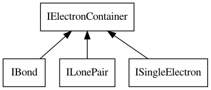

# Paired and unpaired electrons

The CDK data model supports more than just the chemical graph.
We have seen atoms and bonds earlier, the bonds being atoms
sharing electrons. Atoms, however, can also have electrons
in the valence shell not involved in bond: free electon (lone)
pairs, and unpaired electrons as found in radicals.

But before we look at how we add paired and unpaired electrons,
we should first look at the two principle classes involved
in representing these concepts. Like bonds,
a free electron pair and a unpaired electron are bound to
the atom. Depending on the theory used, the exact environment
which holds the electrons can be named differently. For
example, they might be referred to as orbitals, atomic or
molecular. The CDK simply refers to the holder as
<topic>IElectronContainer</topic>s, and has several subinterfaces
for bonds (<class>IBond</class>), lone pairs (<class>ILonePair</class>),
and unpaired electrons (<class>ISingleElectron</class>), as
shown in Figure <xref>ecInheritance</xref>.

<figure label="ecInheritance" caption="The `IBond`, `ILonePair`, and `ISingleElectron` interfaces all extend the `IElectronContainer` interface."

</figure>

## Lone Pairs

Oxygens are atoms with <topic>lone pairs</topic>: the free electrons that do
not take part in a bond. These lone pairs can be explicitly modeled
in the CDK. For example, this is how we can represent <topic>water</topic>:

<code>LonePairOxygen</code>

And we can the count the number of lone pair on each atom with,
for example, this code:

<code>LonePairCount</code>

which gives us:

<out>LonePairCount</out>

## Unpaired electrons

An <topic>unpaired electron</topic> on an atom makes that atom a
<topic>radical</topic>. Radicals are common mass spectroscopy and as the
latter is an important use case of the CDK, unpaired electrons
are well-supported in the data model.

We can add an unpaired electron with the `addSingleElectron`
method of the <class>IAtomContainer</class> class.

<code>HydrogenRadical</code>

